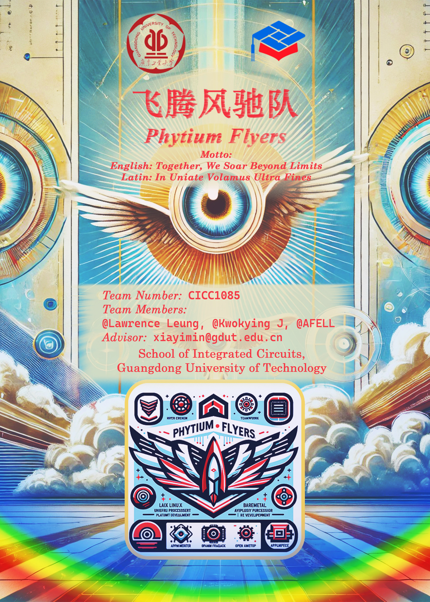

# Wisdom Eye: Outdoor Safety Companion for the Visually Impaired

**Team Name**: Phytium Flyers  
**Team ID**: CICC1085  
**Competition**: The 8th National College Students Integrated Circuit Innovation and Entrepreneurship Competition - Phytium Cup  
**Award**: National Finals First Prize  
**Team Motto**: "Together, We Soar Beyond Limits"  

## Introduction

Wisdom Eye is an innovative outdoor safety companion designed to assist visually impaired individuals in navigating urban environments safely and independently. The system leverages advanced AI visual processing, real-time voice feedback, and comprehensive monitoring to provide seamless navigation and hazard detection, ensuring a secure and informed outdoor experience.

## Features and Application

- **Obstacle Detection**: Utilizes a self-trained YOLOv8n model for real-time detection of various obstacles, such as vehicles, pedestrians, and objects.
- **Zebra Crossing and Traffic Light Detection**: Detects and provides directional guidance for zebra crossings and identifies traffic light statuses.
- **Staircase Recognition**: Counts and identifies the direction of staircases using edge detection and slope analysis.
- **Real-time Voice Feedback**: Offers timely audio cues regarding obstacles, road conditions, and navigation directions, tailored to the visually impaired user's needs.
- **Guardian Monitoring**: Includes a guardian client interface for remote monitoring of the user's environment, position, and safety status.

## Technical Overview

### System Architecture

- **Master System**: Runs on 3 high-performance cores, responsible for image processing, system state management, and guardian client display.
- **Slave System**: Runs on a single real-time core, handling sensor data processing and voice feedback output.

### OpenAMP Communication

- Utilizes OpenAMP for inter-core communication with four static endpoints, ensuring parallel and non-blocking data transmission.

### Innovation Points

1. **Staircase Recognition Algorithm**: Improved accuracy in various lighting and texture conditions by refining the peak analysis method in line detection.
2. **Lightweight Object Detection Network**: Enhanced processing speed through INT8 & FLOAT16 quantization of the YOLOv8n model, maintaining a balance between accuracy and performance.
3. **Monocular Distance and Angle Calculation**: Provides precise spatial orientation using a combination of bounding box analysis and geometric transformations.
4. **Custom Roadside Walking Detection**: Original method for ensuring users stay aligned with the road direction using real-time GPS and motion data.
5. **Parallel Processing Framework**: Achieves true parallelism in image processing and neural network inference by utilizing Python's Multiprocessing module, resolving performance competition issues between different tasks.

## Project Members

- **Lawrence Leung**: Lead Developer, System Architect, undergraduate student of School of Automation, GDUT
- **Kwokying Jim**: Developer, Guardian Client Interface, undergraduate student of School of Integrated Circuits, GDUT
- **AFELL (Zhou Zilin)**: Developer, Sensor Integration, undergraduate student of School of Integrated Circuits, GDUT  
- **Advisor**: Assiociate Prof. Xia Yimin (School of Integrated Circuits, GDUT) *(E-mail: [xiayimin@gdut.edu.cn](mailto:xiayimin@gdut.edu.cn))*

## Repository Structure

```
├── sourcecode/
│ ├── masterdevice/                Source code and executable files for master system on Ubuntu Linux
│ ├── slavedevice/                 Source code and firmware (.elf files) for slave system
│ ├── kernel_managed/              Linux kernel image, device tree, drivers for our project
│ └── README.txt                   A readme file for how to execute all programs of this project, as well as update log records
├── documents/
│ ├── design_documentation.pdf     Comprehensive design documentation of this project (Chinese only)
│ ├── presentation_document.pdf    Presentation document for demonstration of thie project (Chinese only)
│ └── poster.jpg                   Poster for promotion during competition
├── LICENSE                        GPL v3.0 license file
└── README.md                      This file :)
```

## System Specifications

### Master System

- **Hardware**: Phytium Pi Evaluation Kit v2.1 (SoC: E2000Q, 4GiB RAM) Development Board (Core 0~2)
- **Operating System**: Ubuntu Linux 20.04 LTS, with custom drivers and device tree, Linux kernel 5.10 (modified)
- **Software**: OpenCV4 (Python) v4.9.0.80, MNN (OpenCV4), Custom YOLOv8n, Python 3.8, PySide6 v6.6.2

### Slave System

- **Hardware**: Phytium Pi Evaluation Kit v2.1 (SoC: E2000Q, 4GiB RAM) Development Board (Core 3)
- **Operating System**: FreeRTOS
- **Sensors**:
  - Temperature & Humidity Sensor (Model: DHT11, Protocol: OneWire)
  - GPS Module & 3-axis Accelerometer and Compass (Model: Zhongkewei ATGM336H-5N, Protocol: UART TTL-232)
  - TTS Chinese Voice Broadcasting Module (Model: iFlytek XFS5152CE, Protocol: I2C)
  - USB Camera (Model: LeTMC-520, Protocol: USB 3.0)

## Call for Contributions

We invite developers and researchers worldwide to contribute to and enhance Wisdom Eye. Specific areas for improvement include:

### Known Issues

1. **TTS Voice Delay on Slave**: There is a noticeable delay in the TTS voice output due to hardware limitations. Contributions are welcome to address this blocking delay in the hardware output.
2. **Performance Competition Between CV and Neural Network Inference on Master**: The current solution involves fixed delays to balance performance. We seek contributions on dynamically adjusting performance between these tasks.
3. Other issues to be discovered. If there's any other issues found, please notice me via e-mail.

## License

This project is licensed under the [GPL v3 License](LICENSE). Please refer to the license file for more details.

## Acknowledgments

We would like to thank our advisor, Tianjin Phytium Information Technology Co., Ltd. the National College Students Integrated Circuit Innovation and Entrepreneurship Competition committee for their support.
