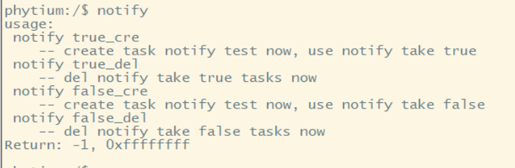

# task notify feature base on freertos

## 1. 例程介绍

本例程示范了freertos环境下的task notify的使用，主要是ulTaskNotifyTake的参数xClearCountOnExit设置不同值的情况，
xClearCountOnExit设置为 pdFALSE 时，函数 xTaskNotifyTake()退出前，将任务的通知值减 1，可以用来实现计数信号量；设置为 pdTRUE 时，函数xTaskNotifyTake()退出前，将任务通知值清零，可以用来实现二值信号量;

FreeRTOS 从 V8.2.0 版本开始提供任务通知这个功能，每个任务都有一个 32 位的通知值，在大多数情况下，任务通知可以替代二值信号量、计数信号量、事件组，也可以替代长度为 1 的队列（可以保存一个 32 位整数或指针值）。
相对于以前使用 FreeRTOS 内核通信的资源，必须创建队列、二进制信号量、计数信号量或事件组的情况，使用任务通知显然更灵活。按照 FreeRTOS 官方的说法，使用任务通知比通过信号量等 ICP 通信方式解除阻塞的任务要快 45%，并且更加省 RAM 内存空间（使用 GCC 编译器，-o2 优化级别），任务通知的使用无需创建队列。


## 2. 如何使用例程

本例程需要用到
- Phytium开发板（FT2000-4/D2000/E2000D/E2000Q/PHYTIUMPI）
- [Phytium freeRTOS SDK](https://gitee.com/phytium_embedded/phytium-free-rtos-sdk)
- [Phytium standalone SDK](https://gitee.com/phytium_embedded/phytium-standalone-sdk)
### 2.1 硬件配置方法

本例程支持的硬件平台包括

- FT2000-4
- D2000
- E2000D
- E2000Q
- PHYTIUMPI

对应的配置项是，

- CONFIG_TARGET_FT2004
- CONFIG_TARGET_D2000
- CONFIG_TARGET_E2000D
- CONFIG_TARGET_E2000Q
- CONFIG_TARGET_PHYTIUMPI

### 2.2 SDK配置方法

本例程需要，

- 使能Shell

对应的配置项是，

- CONFIG_USE_LETTER_SHELL

本例子已经提供好具体的编译指令，以下进行介绍:
- make 将目录下的工程进行编译
- make clean  将目录下的工程进行清理
- make image   将目录下的工程进行编译，并将生成的elf 复制到目标地址
- make list_kconfig 当前工程支持哪些配置文件
- make load_kconfig LOAD_CONFIG_NAME=<kconfig configuration files>  将预设配置加载至工程中
- make menuconfig   配置目录下的参数变量
- make backup_kconfig 将目录下的sdkconfig 备份到./configs下

具体使用方法为:
- 在当前目录下
- 执行以上指令

### 2.3 构建和下载

><font size="1">描述构建、烧录下载镜像的过程，列出相关的命令</font><br />

[参考 freertos 使用说明](../../../docs/reference/usr/usage.md)

#### 2.3.1 下载过程

- host侧设置重启host侧tftp服务器
```
sudo service tftpd-hpa restart
```

- 开发板侧使用bootelf命令跳转
```
setenv ipaddr 192.168.4.20  
setenv serverip 192.168.4.50 
setenv gatewayip 192.168.4.1 
tftpboot 0x90100000 freertos.elf
bootelf -p 0x90100000
```

### 2.4 输出与实验现象

- 系统进入后，输入```notify```查看指令说明
- 输入```notify true_cre```，启动ulTaskNotifyTake pdTRUE测试
- 输入```notify true_del```，删除ulTaskNotifyTake pdTRUE测试
- 输入```notify false_cre```，启动ulTaskNotifyTake pdFALSE测试
- 输入```notify false_del```，删除ulTaskNotifyTake pdFALSE测试
- 测试任务能够能正常创建和删除，输入```ps```查看任务状态正常，即测试正常



## 3. 如何解决问题


## 4. 修改历史记录


