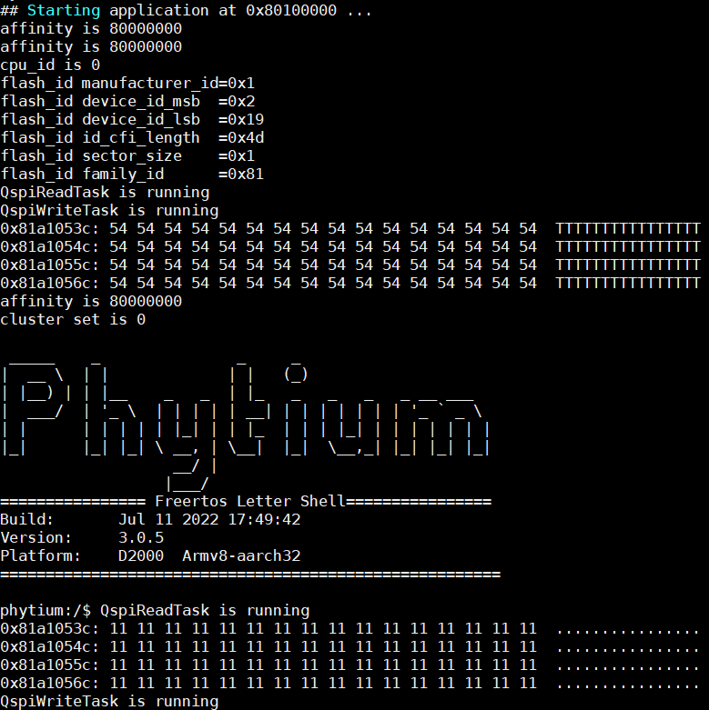

# qspi base on freertos

## 1. 例程介绍

本例程示范了freertos环境下的qspi的读写使用，包括qspi的初始化、读、写、读id和去初始化操作；
程序启动后，创建qspi的初始化、读和写任务；
创建单次模式的软件定时器，回调函数为删除qspi的读和写任务；
例程在FT2000/4上使用的Nor Flash介质型号是GD25Q256，容量为32MB;
E2000D上使用的Nor Flash介质型号是GD25Q128，容量为16MB;

## 2. 如何使用例程

本例程需要用到
- Phytium开发板:FT2000-4/D2000/E2000D/E2000Q/PhytiumPi(包含QSPI-FLASH芯片座)
- [Phytium freeRTOS SDK](https://gitee.com/phytium_embedded/phytium-free-rtos-sdk)
- [Phytium standalone SDK](https://gitee.com/phytium_embedded/phytium-standalone-sdk)
### 2.1 硬件配置方法

本例程支持的硬件平台包括
- FT2000/4、D2000、E2000D、E2000Q、PhytiumPi开发板

对应的配置项是
- CONFIG_TARGET_FT2004
- CONFIG_TARGET_D2000
- CONFIG_TARGET_E2000D
- CONFIG_TARGET_E2000Q
- CONFIG_TARGET_PHYTIUMPI


- 本例程适配了GD25、S25FS256、BOYA的Nor-Flash芯片，如使用其他型号，需自行参考适配

### 2.2 SDK配置方法

本例程需要，

- 使能Shell

对应的配置项是，

- CONFIG_USE_LETTER_SHELL

本例子已经提供好具体的编译指令，以下进行介绍:
- make 将目录下的工程进行编译
- make clean  将目录下的工程进行清理
- make image   将目录下的工程进行编译，并将生成的elf 复制到目标地址
- make list_kconfig 当前工程支持哪些配置文件
- make load_kconfig LOAD_CONFIG_NAME=<kconfig configuration files>  将预设配置加载至工程中
- make menuconfig   配置目录下的参数变量
- make backup_kconfig 将目录下的sdkconfig 备份到./configs下

具体使用方法为:
- 在当前目录下
- 执行以上指令

### 2.3 构建和下载

><font size="1">描述构建、烧录下载镜像的过程，列出相关的命令</font><br />

[参考 freertos 使用说明](../../../docs/reference/usr/usage.md)

#### 2.3.1 下载过程

- host侧设置重启host侧tftp服务器
```
sudo service tftpd-hpa restart
```

- 开发板侧使用bootelf命令跳转
```
setenv ipaddr 192.168.4.20  
setenv serverip 192.168.4.50 
setenv gatewayip 192.168.4.1 
tftpboot 0x90100000 freertos.elf
bootelf -p 0x90100000
```

### 2.4 输出与实验现象

- 系统进入后，创建qspi初始化任务，读取flash id信息，创建qspi的读写任务，周期10000ms，并创建软件定时器，周期50000ms



- 50000ms时间到，触发软件定时器的回调函数，去初始化qspi，删除qspi的读写任务，删除软件定时器


## 3. 如何解决问题

- 若出现读写异常，需确认Norflash型号是否已经适配；
- FLASH_ADDR需要根据实际的flash大小来确定；
- 由于开发板上的QSPI接口的NorFlash用于固件启动，因此不建议在不了解固件大小的情况下，使用qspi write写数据，因为这可能导致固件无法正常启动；

## 4. 修改历史记录


