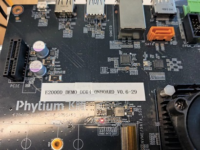
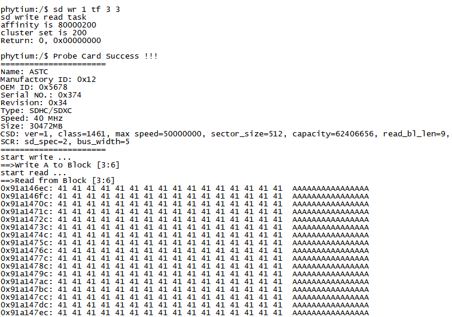
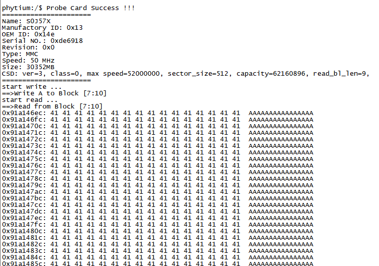

# SD卡(TF/eMMC)读写测试

## 1. 例程介绍

SD存储卡(Secure Digital Memory Card), 是一种基于半导体快闪记忆器的新一代记忆设备，由于它体积小、数据传输速度快、可热插拔等优良的特性，被广泛地于便携式装置上使用, 本例程提供了两类常见SD存储设备的读写支持，

- TF(Transflash Card)卡，也称 MicroSD卡，体积为15mm x 11mm x 1mm，主要配合卡套，实现可扩展的存储器
- eMMC (Embedded Multi Media Card)卡，主要实现的内嵌式存储器标准规格

TF 卡和 eMMC 卡的常见容量包括 4G、8G、16G、32G、64G 和 128G

SD卡的通信依赖三种数据格式：命令包，响应包，数据包，控制器通过一定的命令格式和顺序可以控制读写 SD 卡设备内部寄存器，获取卡信息，完成与卡的数据交互

## 2. 如何使用例程

本例程需要用到
- Phytium开发板（E2000D/E2000Q/PhytiumPi）
- [Phytium FreeRTOS SDK](https://gitee.com/phytium_embedded/phytium-free-rtos-sdk)
- [Phytium Standalone SDK](https://gitee.com/phytium_embedded/phytium-standalone-sdk)



### 2.1 硬件配置方法

本例程支持的硬件平台包括

- E2000D
- E2000Q
- PHYTIUMPI

对应的配置项是，

- CONFIG_TARGET_E2000D
- CONFIG_TARGET_E2000Q
- CONFIG_TARGET_PHYTIUMPI

本例程在 E2000-测试板B上完成测试，在测试板B上，SD-0控制器连接TF卡，SD-1控制器连接eMMC

### 2.2 SDK配置方法

本例程需要，

- 使能Shell
- 使能SPI
- 使能SDMMC

对应的配置项是，

- CONFIG_USE_LETTER_SHELL
- CONFIG_FREERTOS_USE_FSDIO
- CONFIG_USE_SDMMC_CMD

本例子已经提供好具体的编译指令，以下进行介绍:
- make load_e2000q_aarch64  将预设64bit e2000q 下的配置加载至工程中
- make load_e2000q_aarch32  将预设32bit e2000q 下的配置加载至工程中
- make 将目录下的工程进行编译
- make clean  将目录下的工程进行清理
- make image   将目录下的工程进行编译，并将生成的elf 复制到目标地址
- make menuconfig   配置目录下的参数变量
- make backup_kconfig 将目录下的sdkconfig 备份到./configs下

具体使用方法为:
- 在当前目录下
- 执行以上指令

### 2.3 构建和下载

#### 2.3.1 构建过程

- 在host侧完成配置
> 配置成 e2000q，对于其它平台，使用对于的默认配置，如,

- 选择目标平台
```
make load_kconfig LOAD_CONFIG_NAME=e2000q_aarch64_demo_sdio
```

- 选择例程需要的配置
```
make menuconfig
```

- 进行编译
```
make
```

- 将编译出的镜像放置到tftp目录下
```
make image
```

#### 2.3.2 下载过程

- host侧设置重启host侧tftp服务器
```
sudo service tftpd-hpa restart
```

- 开发板侧使用bootelf命令跳转
```
setenv ipaddr 192.168.4.20  
setenv serverip 192.168.4.50 
setenv gatewayip 192.168.4.1 
tftpboot 0xa0100000 freertos.elf
bootelf -p 0xa0100000
```

### 2.4 输出与实验现象

- 系统进入后，创建任务初始化tf卡，循环读写Tf卡中第3~6块的内容
>注意：飞腾派上没有emmc，作为外插的sd口连接控制器0，且使用tf卡进行读写操作时需要避开固件存储的范围，请使用命令：sd wr 0 tf 10485760 3

```
sd wr 1 tf 3 3 
```



- 系统进入后，创建任务初始化eMMC，循环读写eMMC中第7~9块的内容
>注意：飞腾派上没有emmc，无法使用下面的命令

```
sd wr 0 emmc 7 3 
```



## 3. 如何解决问题


## 4. 修改历史记录
