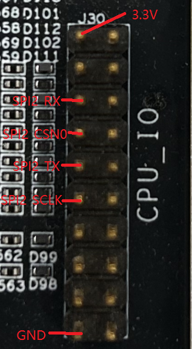

# SFUD读写测试

## 1. 例程介绍

[SFUD](https://gitee.com/Armink/SFUD) 是一款串行 SPI Flash 通用驱动库，设计的主要目标是屏蔽不同串行 Flash 的规格和命令差异，使用 SFUD 的接口可以在一套驱动和应用程序的基础上支持多种 Flash, 同时简化新增 Flash 的复杂度

本例程通过 SPI 主设备驱动和 SFUD 通用协议框架，支持在nor flash进行读写

## 2. 如何使用例程

本例程需要用到
- Phytium开发板(E2000D/E2000Q/FT2000-4/D2000/PhytiumPi)
- [Phytium FreeRTOS SDK](https://gitee.com/phytium_embedded/phytium-free-rtos-sdk)
- [Phytium Standalone SDK](https://gitee.com/phytium_embedded/phytium-standalone-sdk)
- Flash芯片

### 2.1 硬件配置方法

本例程支持的硬件平台包括

- E2000D，E2000Q，FT2000/4，D2000，PhytiumPi

对应的配置项是，

- CONFIG_TARGET_E2000D
- CONFIG_TARGET_E2000Q
- CONFIG_TARGET_FT2004
- CONFIG_TARGET_D2000
- CONFIG_TARGET_PHYTIUMPI

### 2.1.1 E2000
- E2000 demo板需使用杜邦线外接Flash进行测试，方法如下



- 上图为E2000开发板J30与SPI引脚对应图，将flash芯片使用外接连接即可

### 2.1.2 PhytiumPi
- PhytiumPi需使用杜邦线外接Flash进行测试，方法如下


- 上图为PhytiumPi开发板J1与SPI引脚对应图，将flash芯片使用外接连接即可

### 2.2 SDK配置方法

本例程需要，

- 使能Shell
- 使能SPI
- 使能SFUD

对应的配置项是，

- CONFIG_USE_LETTER_SHELL
- CONFIG_USE_S25FS256
- CONFIG_FREERTOS_USE_QSPI

本例子已经提供好具体的编译指令，以下进行介绍:
- make 将目录下的工程进行编译
- make clean  将目录下的工程进行清理
- make image   将目录下的工程进行编译，并将生成的elf 复制到目标地址
- make list_kconfig 当前工程支持哪些配置文件
- make load_kconfig LOAD_CONFIG_NAME=<kconfig configuration files>  将预设配置加载至工程中
- make menuconfig   配置目录下的参数变量
- make backup_kconfig 将目录下的sdkconfig 备份到./configs下

具体使用方法为:
- 在当前目录下
- 执行以上指令

### 2.3 构建和下载

><font size="1">描述构建、烧录下载镜像的过程，列出相关的命令</font><br />

[参考 freertos 使用说明](../../../docs/reference/usr/usage.md)

#### 2.3.1 下载过程

- host侧设置重启host侧tftp服务器
```
sudo service tftpd-hpa restart
```

- 开发板侧使用bootelf命令跳转
```
setenv ipaddr 192.168.4.20  
setenv serverip 192.168.4.50 
setenv gatewayip 192.168.4.1 
tftpboot 0xa0100000 freertos.elf
bootelf -p 0xa0100000
```

### 2.4 输出与实验现象

- 系统进入后，创建任务初始化sfud, 读取flash id信息

```
sf probe
```


- 初始化成功后，在flash的偏移量0x20位置，写入一段不带空格的连续字符串，如‘write-spi-nor-flash-from-freertos-sfud’

```
sf write 0x10  "write-spi-nor-flash-from-freertos-sfud"
```

- 写入成功后，从flash的偏移量0x0开始，读取64个字节

```
sf read 0x0
```


## 3. 如何解决问题

- Q: 如何适配新的的 nor flash
- A: 本例程的测试基于 博雅的 BY25Q64BS 系列 nor flash 完成，对于其它支持 SFDP 的 nor flash，可能不需要特别适配就可以使用，如果 SFDP 信息获取失败，可以参考 "BY25Q64BS" 的适配方法，将 nor flash 的信息加入 SFUD 的 SFUD_FLASH_CHIP_TABLE，加入成功后应该就可以使用

- Q: 如何设置 spi 的采样相位
- A: 博雅的 BY25Q64BS 系列 nor flash，支持的采样相位设置为模式0（CPOL = 0, CPHA = 0）和模式3（CPOL = 1, CPHA = 1），对于其它 nor flash，需要查阅手册，在 sfud_port.c 进行对应的修改

> 如下图所示，是 BY25Q64BS 支持的采样相位模式


## 4. 修改历史记录


