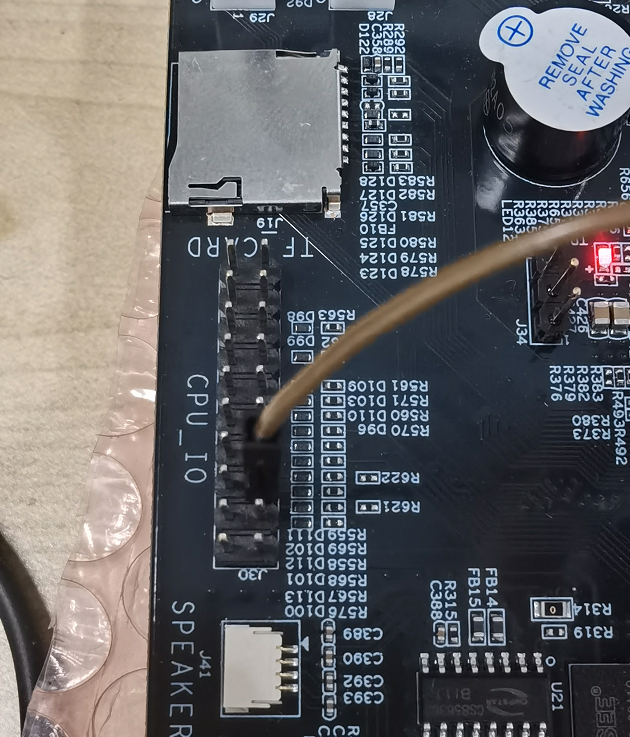
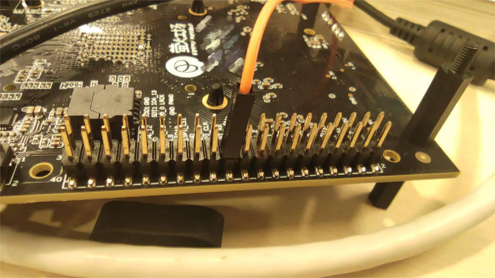
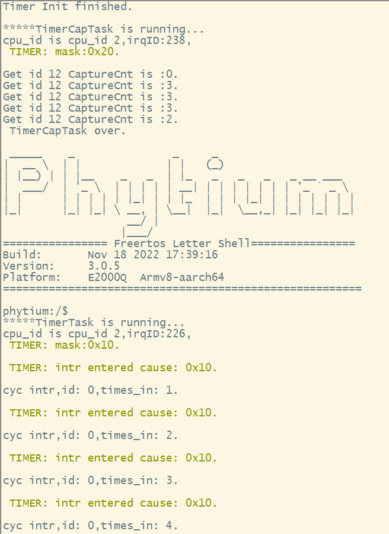
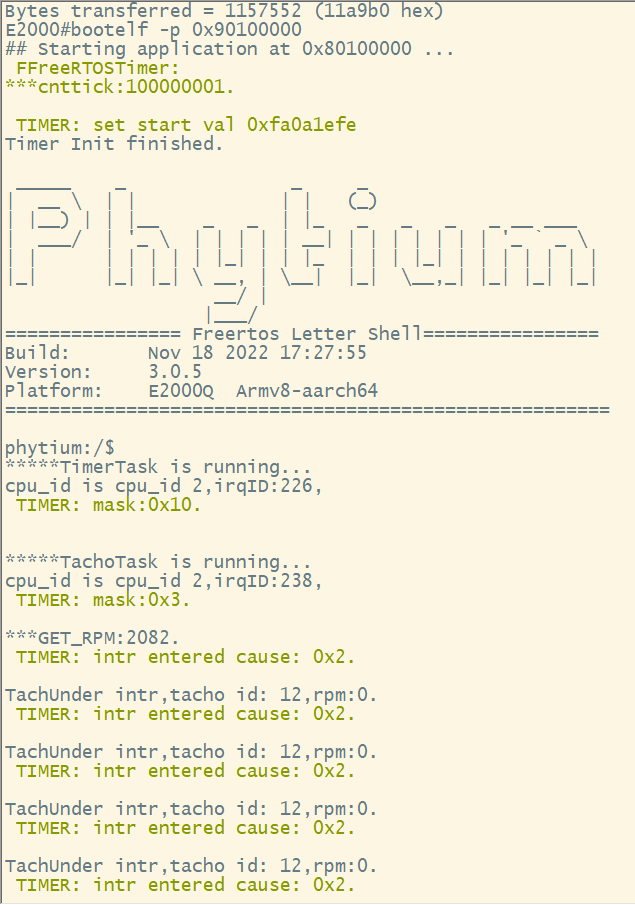

# timer_tacho base on freertos

## 1. 例程介绍

本例程示范了freertos环境下的timer、tacho和capture的使用，包括timer控制器的初始化、定时、信号捕捉操作;
程序启动后，创建timer、tacho或capture（两者使用同一IO，默认tacho，变更需要更改初始化和任务）的初始化任务,分别测试定时功能，采样转换功能，以及脉冲计数触发功能;
例程仅仅支持E2000上使用;
E2000DQ上使用的demo板上的 PWM-IN12(tacho—in12) 进行测试。

## 2. 如何使用例程

本例程需要用到
- Phytium开发板（E2000DQ of demo板）
- [Phytium freeRTOS SDK](https://gitee.com/phytium_embedded/phytium-free-rtos-sdk)
- [Phytium standalone SDK](https://gitee.com/phytium_embedded/phytium-standalone-sdk)
### 2.1 硬件配置方法

本例程支持的硬件平台包括
- E2000DQ demo开发板
- PhytiumPi 开发板

对应的配置项是

- CONFIG_TARGET_E2000D、 CONFIG_TARGET_E2000Q 
- CONFIG_TARGET_PHYTIUMPI

### 2.1.1 硬件连线

- E2000 pwm_in12使用1KHz的方波



- PHYTIUMPI 硬件连线



### 2.2 SDK配置方法

本例程需要，

- CONFIG_USE_LETTER_SHELL
- CONFIG_FREERTOS_USE_TIMER
- CONFIG_LS_PL011_UART

本例子已经提供好具体的编译指令，以下进行介绍:
- make 将目录下的工程进行编译
- make clean  将目录下的工程进行清理
- make image   将目录下的工程进行编译，并将生成的elf 复制到目标地址
- make list_kconfig 当前工程支持哪些配置文件
- make load_kconfig LOAD_CONFIG_NAME=< kconfig configuration files >  将预设配置加载至工程中
- make menuconfig   配置目录下的参数变量
- make backup_kconfig 将目录下的sdkconfig 备份到./configs下

具体使用方法为:
- 在当前目录下
- 执行以上指令

### 2.3 构建和下载

#### 2.3.1 构建过程

本文档将以E2000Ddemo开发板为例，对于其它平台，使用对应的默认配置

- 在host端完成配置
- 选择目标平台

```
make load_kconfig LOAD_CONFIG_NAME=e2000d_aarch64_demo_timer
```

- 选择例程需要的配置

```
make menuconfig
```

- 进行编译
```
make
```

- 将编译出的镜像放置到tftp目录下
```
make image
```

#### 2.3.2 下载过程

- host侧设置重启host侧tftp服务器
```
sudo service tftpd-hpa restart
```

- 开发板侧使用bootelf命令跳转
```
setenv ipaddr 192.168.4.20  
setenv serverip 192.168.4.50 
setenv gatewayip 192.168.4.1 
tftpboot 0x90100000 freertos.elf
bootelf -p 0x90100000
```

### 2.4 输出与实验现象

- 系统进入后，创建timer初始化任务，创建tacho初始化任务，注册中断服务函数，创建两个功能的任务函数。

- E2000





- 图中我们使用timer id 0 作为定时器任务的控制器,time in 的数字表示进入循环定时中断服务的次数。
- get captureCnt表示使用timer id 12控制器来采集脉冲的个数（设置上升沿捕获）
- tachometer id使用timer id 12控制器来抓取1KHz信号来模拟风扇波形信号。RPM表示转速

## 3. 如何解决问题

- 若出现风扇中断异常，需确认连接是否正确，确保风扇波形不低于报警中断的最低设置转速。

- 由于timer控制器的数量远多余pwm_in IO口数值，所以尽量使用id 15后面的定时控制器来做普通定时器。

## 4. 修改历史记录
v0.1.0 init
