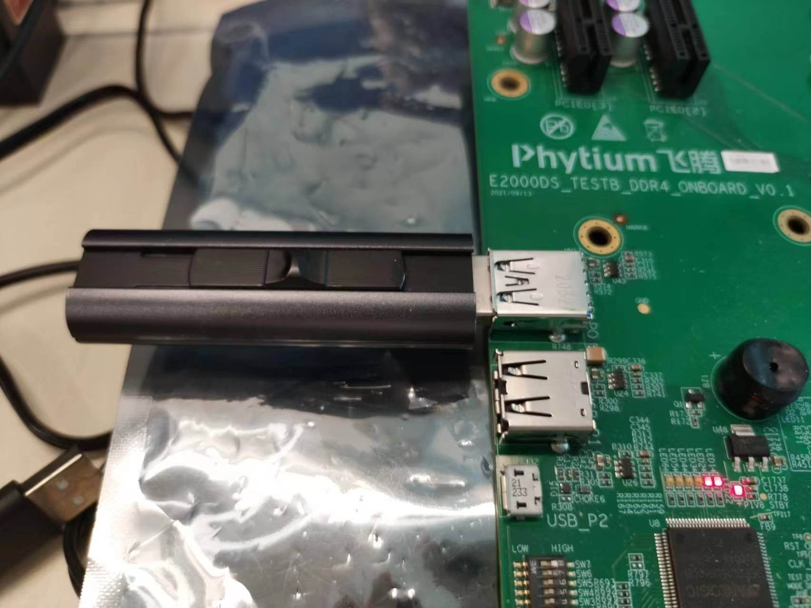
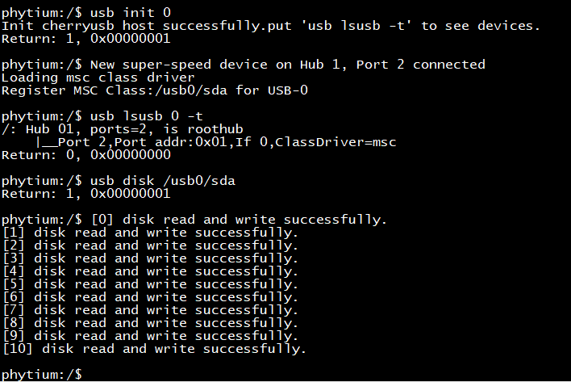
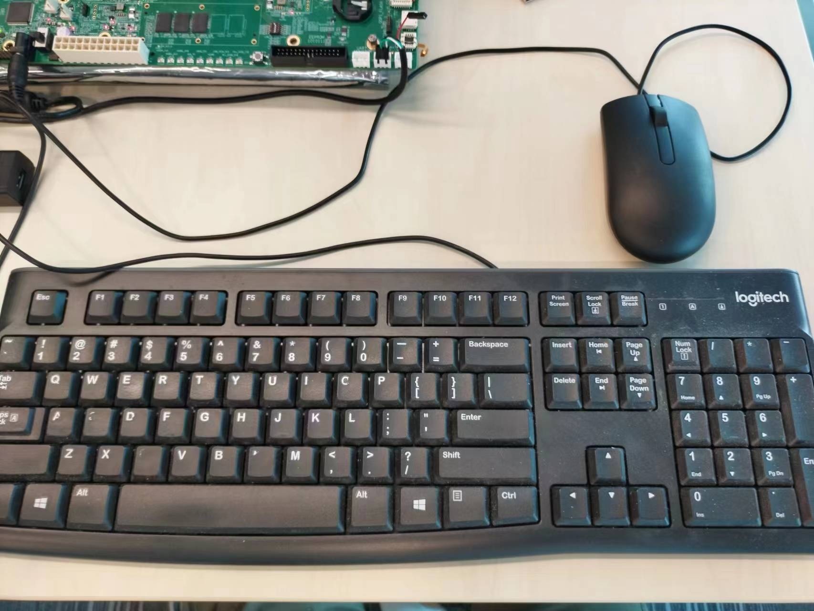
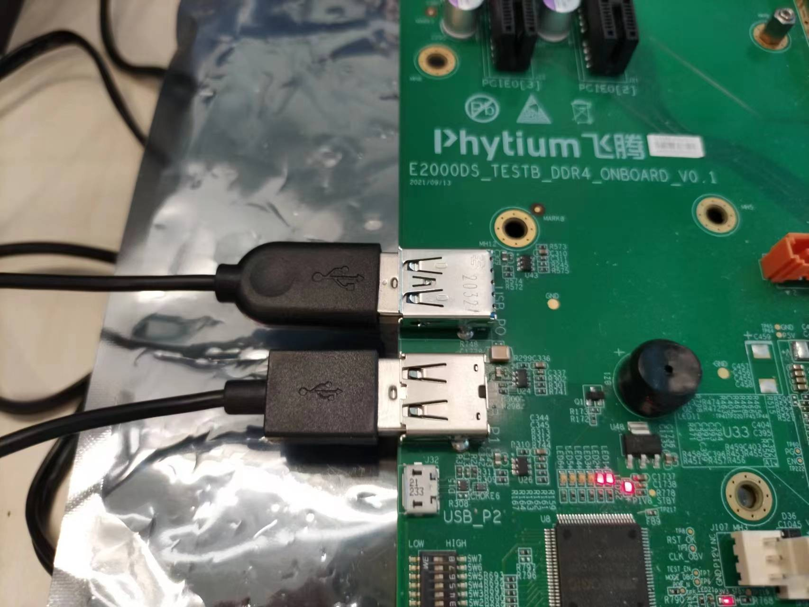
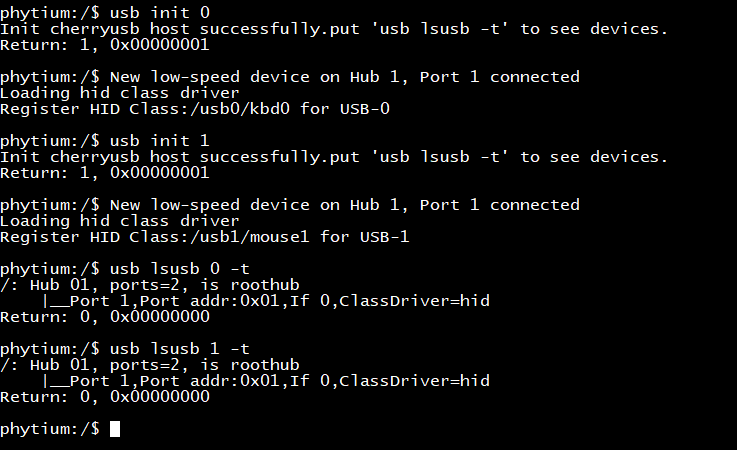
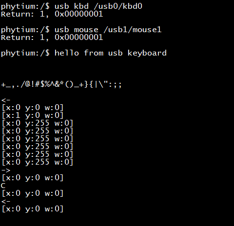

# CherryUSB Host 测试

## 1. 例程介绍

><font size="1">介绍例程的用途，使用场景，相关基本概念，描述用户可以使用例程完成哪些工作</font><br />

CherryUSB 是一个用于嵌入式系统 USB 协议栈，支持运行在Host模式和Device模式

## 2. 如何使用例程

><font size="1">描述开发平台准备，使用例程配置，构建和下载镜像的过程</font><br />

### 2.1 硬件配置方法

><font size="1">哪些硬件平台是支持的，需要哪些外设，例程与开发板哪些IO口相关等（建议附录开发板照片，展示哪些IO口被引出）</font><br />

本例程在 E2000 平台测试通过，您可以参考以下方法配置本例程所需要的硬件和软件环境，
- E2000开发板
- 本例程基于E2000 Demo 开发板，使用logitech键盘、Dell鼠标和Sandisk盘完成测试

### 2.2 SDK配置方法

><font size="1">依赖哪些驱动、库和第三方组件，如何完成配置（列出需要使能的关键配置项）</font><br />

本例程需要的配置包括，
- Letter Shell组件，依赖 USE_LETTER_SHELL

本例子已经提供好具体的编译指令，以下进行介绍:
- make 将目录下的工程进行编译
- make clean  将目录下的工程进行清理
- make image   将目录下的工程进行编译，并将生成的elf 复制到目标地址
- make list_kconfig 当前工程支持哪些配置文件
- make load_kconfig LOAD_CONFIG_NAME=<kconfig configuration files>  将预设配置加载至工程中
- make menuconfig   配置目录下的参数变量
- make backup_kconfig 将目录下的sdkconfig 备份到./configs下

具体使用方法为：
- 在当前目录下
- 执行以上指令

### 2.3 构建和下载

><font size="1">描述构建、烧录下载镜像的过程，列出相关的命令</font><br />

使用例程的一般过程为

- 选择目标平台和例程需要的配置
```
make load_kconfig LOAD_CONFIG_NAME=e2000d_aarch64_demo_cherry_usb
```

- 进行编译
```
make
```

- 将编译出的镜像放置到tftp目录下
```
make image
```

- host侧设置重启host侧tftp服务器
```
sudo service tftpd-hpa restart
```

- 开发板侧使用bootelf命令跳转
```
setenv ipaddr 192.168.4.20  
setenv serverip 192.168.4.50 
setenv gatewayip 192.168.4.1 
tftpboot 0x90100000 freertos.elf
bootelf -p 0x90100000
```

### 2.4 输出与实验现象

><font size="1">描述输入输出情况，列出存在哪些输出，对应的输出是什么（建议附录相关现象图片）</font><br />


#### 2.4.1 读写 U 盘

- 将 U 盘（USB3.0 接口U盘）插在 USB-0 口，初始化 USB-0 控制器后，查看 U 盘设备是否枚举成功，然后通过枚举成功后返回的设备路径`/usb0/sda`读写 U 盘

```
usb init 0
usb lsusb 0 -t
usb disk /usb0/sda
```



- 输入`usb disk`后，启动一个任务不断读写U盘



- 关于 U 盘的进一步使用，可以参考 storage/fatfs 中使用 U 盘文件系统

#### 2.4.2 获取键盘和鼠标输入

- 将键盘插在 USB-0 口，鼠标插在 USB-1 口，分别初始化 USB-0 和 USB-1 控制器，查看键盘和鼠标是否枚举成功，通过枚举成功后返回的设备路径`/usb0/kbd0`和`/usb1/mouse1`，开启键盘和鼠标输入后进行读取

```
usb init 0
usb init 1
usb lsusb 0 -t
usb lsusb 1 -t
usb kbd /usb0/kbd0
usb mouse /usb1/mouse1
```





- 输入`usb input`后，可以通过中断处理键盘输入





- 上图中，首先打印的是通过 USB 键盘输入的字符串，以及一系列特殊字符，然后是鼠标的输入，x和y是鼠标的平面坐标位置，w是鼠标中间滚轮的位置，<-、-> 和 C 分别是按下鼠标左、右键和中间滚轮后的返回

## 3. 如何解决问题

><font size="1">主要记录使用例程中可能会遇到的问题，给出相应的解决方案</font><br />

- 目前 USB 外接 HUB 功能支持未完成，建议 USB 设备直连 Roothub 
1. 通过USB HUB 连接键盘鼠标等低速设备可能会有问题
2. 当前phytiumpi板卡仅有一个usb3.0接口,因此同一时刻仅支持一个外设，可将鼠标或者键盘接入usb3.0。

## 4. 修改历史记录

><font size="1">记录例程的重大修改记录，标明修改发生的版本号 </font><br />

- V0.3.1 首次合入
- v0.1.0 支持USB 3.0 设备枚举


