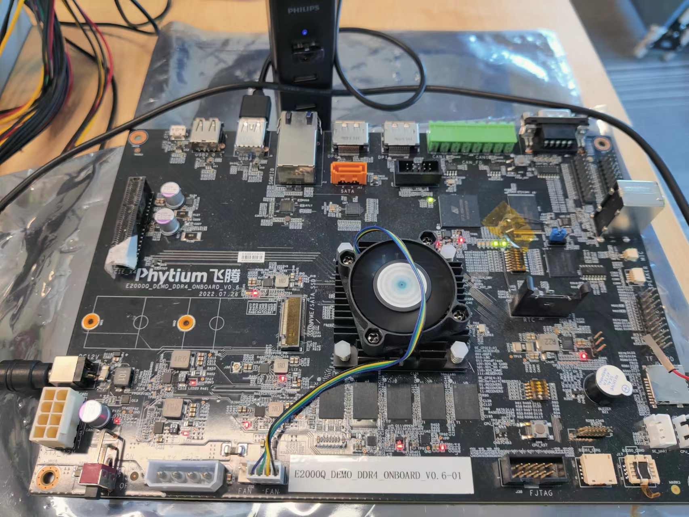
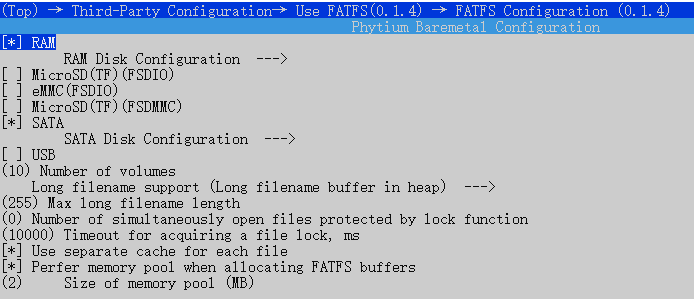
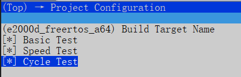
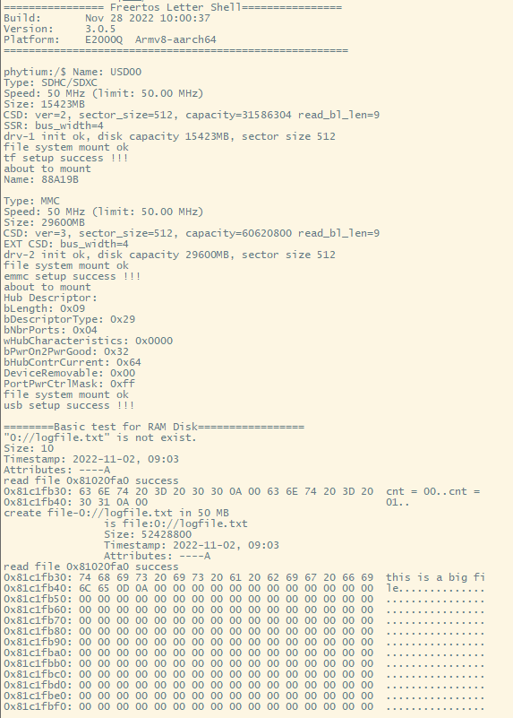
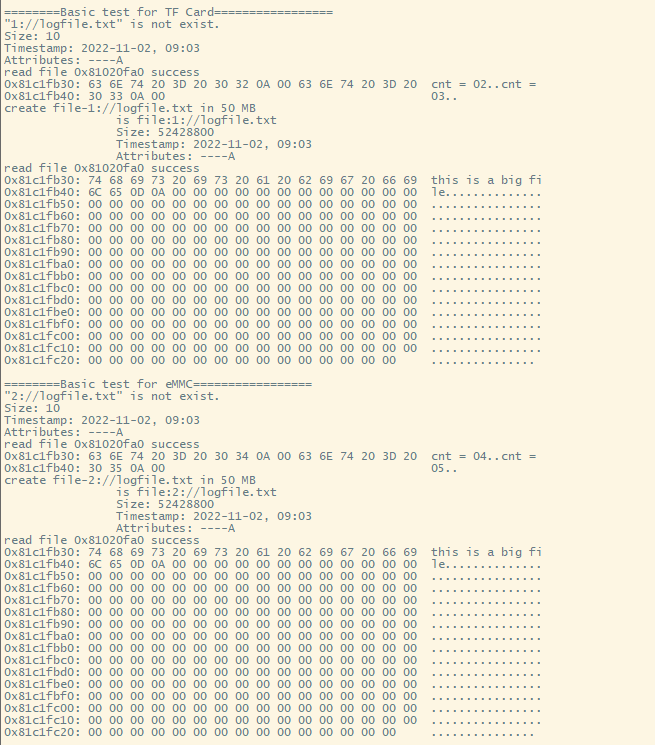
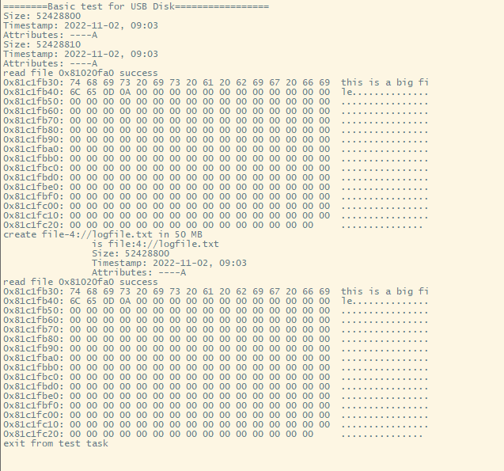
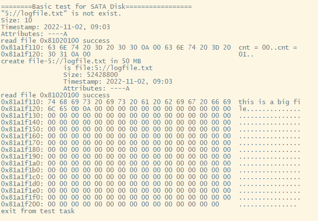
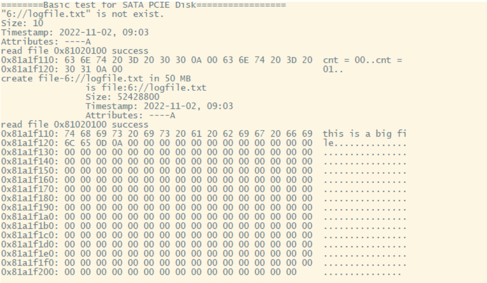

# FATFS 文件系统测试

## 1. 例程介绍

- 文件系统是一类负责管理和存储文件信息的软件机构，在磁盘上组织文件的方法。作为常用的文件系统，FATFS免费开源，专门为小型嵌入式系统设计。
- 本例程中通过在文件系统的根目录下挂载多个目录，支持在 RAM Disk, MicroSD 卡，eMMC 卡，SATA硬盘 和 U盘上同时使用和测试 FATFS 文件系统


## 2. 如何使用例程

本例程需要用到
- Phytium开发板（E2000D/E2000Q/PhytiumPi）
- [Phytium freeRTOS SDK](https://gitee.com/phytium_embedded/phytium-free-rtos-sdk)
- [Phytium standalone SDK](https://gitee.com/phytium_embedded/phytium-standalone-sdk)



### 2.1 硬件配置方法

本例程支持的硬件平台包括
- E2000D、E2000Q、PhytiumPi开发板

注：为防止破坏固件Phytium目前仅支持使用RAM测试

对应的配置项是
- CONFIG_TARGET_E2000D
- CONFIG_TARGET_E2000Q
- CONFIG_TARGET_PHYTIUMPI

### 2.2 SDK配置方法

本例程需要，

- 使能Shell

对应的配置项是，

- CONFIG_USE_LETTER_SHELL

本例子已经提供好具体的编译指令，以下进行介绍:
- make 将目录下的工程进行编译
- make clean  将目录下的工程进行清理
- make image   将目录下的工程进行编译，并将生成的elf 复制到目标地址
- make list_kconfig 当前工程支持哪些配置文件
- make load_kconfig LOAD_CONFIG_NAME=<kconfig configuration files>  将预设配置加载至工程中
- make menuconfig   配置目录下的参数变量
- make backup_kconfig 将目录下的sdkconfig 备份到./configs下

具体使用方法为:
- 在当前目录下
- 执行以上指令

### 2.3 构建和下载

><font size="1">描述构建、烧录下载镜像的过程，列出相关的命令</font><br />

[参考 freertos 使用说明](../../../docs/reference/usr/usage.md)

#### 2.3.1 下载过程

- host侧设置重启host侧tftp服务器
```
sudo service tftpd-hpa restart
```

- 开发板侧使用bootelf命令跳转
```
setenv ipaddr 192.168.4.20  
setenv serverip 192.168.4.50 
setenv gatewayip 192.168.4.1 
tftpboot 0x90100000 freertos.elf
bootelf -p 0x90100000
```

### 2.4 输出与实验现象

- 打开配置 CONFIG_FATFS_SDIO_TF, 使能 MicroSD(TF) 卡
- 打开配置 CONFIG_FATFS_SDIO_EMMC, 使能 eMMC
- 打开配置 CONFIG_FATFS_USB, 使能 U 盘
- 打开配置 CONFIG_FATFS_FSATA, 使能 SATA 硬盘
- 打开配置 CONFIG_FATFS_FSATA_PCIE, 使能 SATA 硬盘与 PCIE 接口

- 打开配置 CONFIG_FATFS_BASIC_TEST，测试 FATFS 的基本功能
- 打开配置 CONFIG_FATFS_SPEED_TEST, 测试 FATFS 的读写速度，会破环文件系统
- 打开配置 CONFIG_FATFS_CYCLE_TEST, 运行 FATFS 的测试项，会破环文件系统
- 编译镜像，加载到开发板上电启动





- 加载镜像启动后，自动开始测试







## 3. 如何解决问题
 