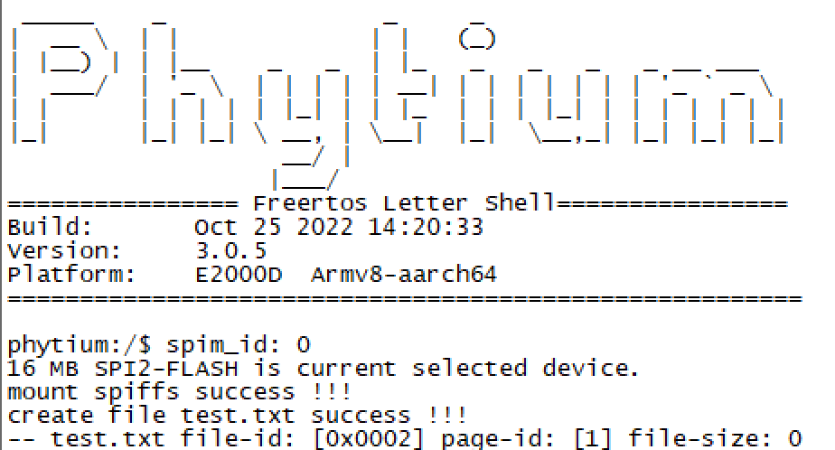
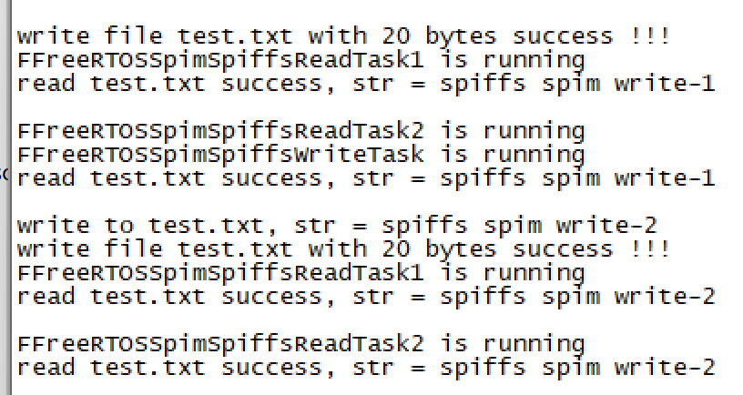
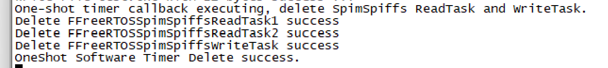

# SPIFFS SPI Nor-flash 文件系统测试
## 1. 例程介绍

><font size="1">介绍例程的用途，使用场景，相关基本概念，描述用户可以使用例程完成哪些工作</font><br />

[SPIFFS](https://github.com/pellepl/spiffs) 是一个面向SPI FLASH的文件系统, 它需要的系统资源极少，可以完全运行在RAM中不需要堆的支持, 有以下几个特点,

- 1. 面向小型嵌入式系统，不要求系统支持堆和动态内存
- 2. 尽可能少地进行擦除，只进行大块擦除，清除小块数据时采用标记的方法
- 3. 支持负载均衡，尽可能延长 Flash 的使用寿命
- 4. 内置文件系统的一致性检查，对文件系统损坏有一定的保护能力
- 5. 使用方便，高度可配置

但是，SPIFFS 也存在以下几个缺陷，

- 1. 不支持目录，SPIFFS 提供的是一个平面结构文件系统，路径 `tmp/myfile.txt` 会直接被创建成一个名字为 `tmp/myfile.txt` 的文件
- 2. 不是实时的，一个写操作的持续时间可能比另一个长得多
- 3. 支持的 Flash 容量不能超过 128 MB
- 4. 不支持坏块检测和坏块处理

本例程通过Freertos下的SPIFFS测试，验证了SPIM Nor-flash文件系统的基本功能，如文件系统格式化，文件的创建、读写、删除和枚举等。


## 2. 如何使用例程

><font size="1">描述开发平台准备，使用例程配置，构建和下载镜像的过程</font><br />

### 2.1 硬件配置方法

><font size="1">哪些硬件平台是支持的，需要哪些外设，例程与开发板哪些IO口相关等（建议附录开发板照片，展示哪些IO口被引出）</font><br />

本例程支持的硬件平台包括
- E2000D demo板
- E2000Q demo板
- PhytiumPi

对应的配置项是
- CONFIG_TARGET_E2000D
- CONFIG_TARGET_E2000Q
- CONFIG_TARGET_PHYTIUMPI

### 2.1.1 E2000
- E2000 demo板需使用杜邦线外接Flash进行测试，方法如下


- 上图为E2000开发板J30与SPI引脚对应图，将flash芯片使用外接连接即可

### 2.1.2 PhytiumPi
- PhytiumPi需使用杜邦线外接Flash进行测试，方法如下


- 上图为PhytiumPi开发板J1与SPI引脚对应图，将flash芯片使用外接连接即可


- 本例程适配了GD25Q256、GD25Q128、GD25Q64、S25FS256的Nor-Flash芯片，如使用其他型号，需自行参考适配
### 2.2 SDK配置方法

><font size="1">依赖哪些驱动、库和第三方组件，如何完成配置（列出需要使能的关键配置项）</font><br />

使能以下配置

- CONFIG_USE_SPI，使能SPI驱动组件
- CONFIG_USE_FSPIM，选择FSPIM驱动
- CONFIG_USE_IOMUX，使能IO复用驱动组件
- CONFIG_ENABLE_FIOMUX，选择FIOMUX驱动
- CONFIG_USE_GPIO，使能GPIO驱动组件
- CONFIG_ENABLE_F_GPIO，选择FGPIO驱动
- CONFIG_USE_SFUD，选择SFUD协议框架
- CONFIG_SFUD_CTRL_FSPIM，关联SFUD框架和FSPIM驱动
- CONFIG_USE_SPIFFS CONFIG_SPIFFS_ON_FSPIM_SFUD，使能SPIFFS

本例子已经提供好具体的编译指令，以下进行介绍:
- make 将目录下的工程进行编译
- make clean  将目录下的工程进行清理
- make image   将目录下的工程进行编译，并将生成的elf 复制到目标地址
- make load_e2000d_aarch64  将预设64bit e2000d 下的配置加载至工程中
- make load_e2000d_aarch32  将预设32bit e2000d 下的配置加载至工程中
- make menuconfig   配置目录下的参数变量
- make backup_kconfig 将目录下的sdkconfig 备份到./configs下

### 2.3 构建和下载

><font size="1">描述构建、烧录下载镜像的过程，列出相关的命令</font><br />

[参考 freertos 使用说明](../../../docs/reference/usr/usage.md)

#### 2.3.1 下载过程

- host侧设置重启host侧tftp服务器
```
sudo service tftpd-hpa restart
```

- 开发板侧使用bootelf命令跳转
```
setenv ipaddr 192.168.4.20  
setenv serverip 192.168.4.50 
setenv gatewayip 192.168.4.1 
tftpboot 0x90100000 freertos.elf
bootelf -p 0x90100000
```

### 2.4 输出与实验现象

><font size="1">描述输入输出情况，列出存在哪些输出，对应的输出是什么（建议附录相关现象图片）</font><br />  

程序启动后，依次创建Init、Read、Write任务，创建单次模式软件定时器用于删除任务，Init任务会首先初始化并挂载spim flash的部分区域（可通过FSPIFFS_IF_FORMAT选择是否进行格式化操作），随后创建一个文件，然后释放信号量通知Read和Write任务开始执行;

- init完成，挂载文件系统完成，创建测试文件


- 读写任务周期性执行，有两个读任务，一个写任务


- 软件定时器触发，删除读写任务


## 3. 如何解决问题

><font size="1">主要记录使用例程中可能会遇到的问题，给出相应的解决方案</font><br />

- FSPIFFS_IF_FORMAT决定初始化阶段是否格式化指定的区域，TRUE为格式化，FLASE为不格式化

## 4. 修改历史记录

><font size="1">记录例程的重大修改记录，标明修改发生的版本号 </font><br />

v0.1. 2022-10-27 首次合入