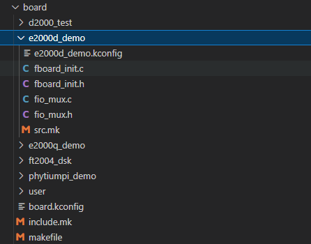

# standalone sdk

## 添加board 的步骤

1. 在board 目录下添加 以board 命名的目录



2. 在board/board.kconfig 文件下添加 board 相关信息，如CUS_DEMO

```
config CUS_DEMO_BOARD
        bool
        prompt "Use Customization board"
        help
            select Customization board config
        if CUS_DEMO_BOARD
            config BOARD_NAME
				string "Write name"
				default "none" 
#           source "$SDK_DIR/board/""/"".kconfig"    
        endif
```

3. （可选操作项目，在2中默认注释）在 board/ 目录下新建 cus_demo 目录，新建 cus_demo.kconfig 文件：

- 此文件用于配置默认board启动的项目，您可以配合fboard_init.c与fboard_init.h使用，用来程序启动时main.c来调用

```
menu "IO mux configuration when board start up"

endmenu
```
- 在 sdkconfig.h 中产生宏定义，调用FBoardStatusInit函数来配合决定启动那些项目

4. 在 cus_demo 目录，添加 fio_mux.c,fio_mux.h 文件：

- 可以参照已经已经写好的soc板 fio_mux.c，fio_mux.h 来配置您 cus_board io复用配置(主要用于自行制作的soc板与我们例程使用的io接口存在差异)

5. 在 cus_demo 目录，添加 src.mk文件：

```
BOARD_CSRC += cus_demo/fio_mux.c
```

- 如果存在fboard_init.c，则也需要添加

6. 在board/ 目录中 include.mk 增加条目 :

```

ifdef CONFIG_CUS_DEMO_BOARD
	BUILD_INC_PATH_DIR += $(SDK_DIR)/board/cus_demo
endif

```

- 主要将 cus_demo 目录下的 *.h文件加入编译

7. 在board/ 目录中 makefile 增加条目 :

```

# Use cus demo board
ifdef CONFIG_CUS_DEMO_BOARD
include cus_emo/src.mk
CSRCS_RELATIVE_FILES := $(BOARD_CSRC) 
endif

```

- 主要将 cus_demo 目录下的 *.c文件加入编译
