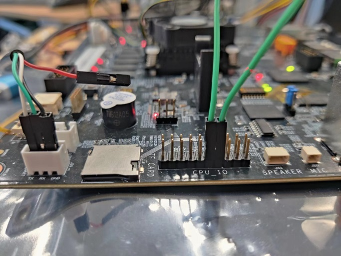
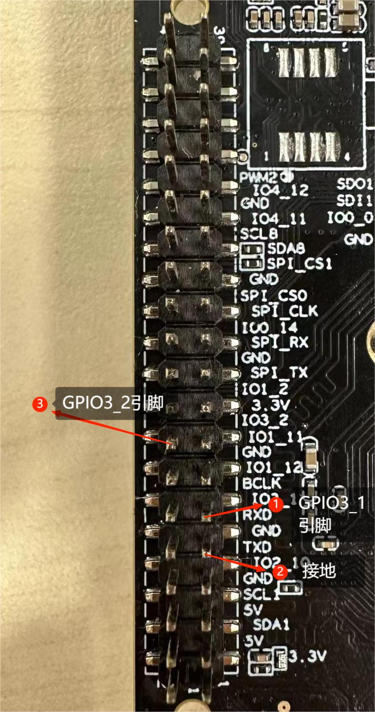
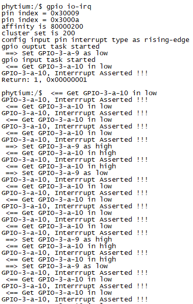

# GPIO测试

## 1. 例程介绍

GPIO (General-purpose input/output)，即通用型输入输出，其引脚可以供使用者通过程序控制其输入、输出，常用于产生时钟，作为片选信号和模拟低速通信协议等场景

本例程通过 GPIO 控制器驱动，实现电平输出和电平输入功能，通过短接输出引脚和输入引脚，实现输入引脚中断触发功能

## 2. 如何使用例程

本例程需要用到
- Phytium开发板（E2000）
- [Phytium FreeRTOS SDK](https://gitee.com/phytium_embedded/phytium-free-rtos-sdk)
- [Phytium Standalone SDK](https://gitee.com/phytium_embedded/phytium-standalone-sdk)

### 2.1 硬件配置方法
- E2000 D/Q Demo 板 或 飞腾派
- 杜邦线

#### 2.1.1 对于E2000 D/Q Demo 板
- 在本例程中连接 GPIO-4-A-11 和 GPIO-4-A-12，分别配置为输入引脚和输出引脚，参考 E2000 Q 数据手册可知，引脚的复用功能6为 GPIO，因此例程中会修改引脚复用，

- GPIO-4-A-11 和 GPIO-4-A-12 的引脚为外侧排第 4 和第 5 引脚，具体情况可以参考 E2000 Q Demo板原理图


- 也可以使用 GPIO-3-A-4 和 GPIO-3-A-5 进行测试  


#### 2.1.2 对于飞腾派
- 需要用杜邦线短接GPIO3_1与GPIO3_2，分别对应飞腾派上的J1组引脚的第11号与第16号引脚


### 2.2 SDK配置方法

本例程需要，

- 使能Shell
- 使能GPIO

对应的配置项是，

- CONFIG_USE_LETTER_SHELL
- CONFIG_FREERTOS_USE_GPIO

本例子已经提供好具体的编译指令，以下进行介绍:
- make 将目录下的工程进行编译
- make clean  将目录下的工程进行清理
- make image   将目录下的工程进行编译，并将生成的elf 复制到目标地址
- make list_kconfig 当前工程支持哪些配置文件
- make menuconfig   配置目录下的参数变量
- make backup_kconfig 将目录下的sdkconfig 备份到./configs下

具体使用方法为:
- 在当前目录下
- 执行以上指令

### 2.3 构建和下载

#### 2.3.1 构建过程

- 在host侧完成配置
> 配置成 e2000q，对于其它平台，使用对于的默认配置，如,

- 选择目标平台
```
make load_kconfig LOAD_CONFIG_NAME=e2000q_aarch64_demo_gpio
```

- 选择例程需要的配置
```
make menuconfig
```

- 编译并将编译出的镜像放置到tftp目录下
```
make image
```

#### 2.3.2 下载过程

- host侧设置重启host侧tftp服务器
```
sudo service tftpd-hpa restart
```

- 开发板侧使用bootelf命令跳转
```
setenv ipaddr 192.168.4.20  
setenv serverip 192.168.4.50 
setenv gatewayip 192.168.4.1 
tftpboot 0xa0100000 freertos.elf
bootelf -p 0xa0100000
```

### 2.4 输出与实验现象

- 系统进入后，创建两个任务，一个控制输出引脚电平，另一个检查输入引脚电平，同时等待中断触发

```
gpio io-irq
```




## 3. 如何解决问题


## 4. 修改历史记录


