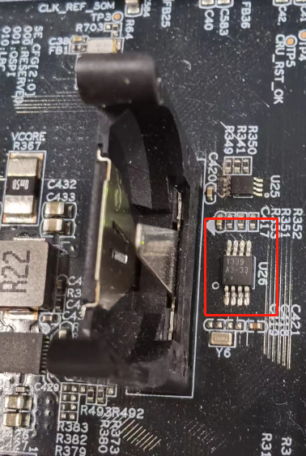
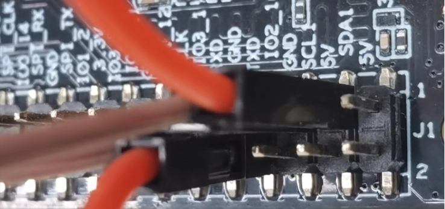
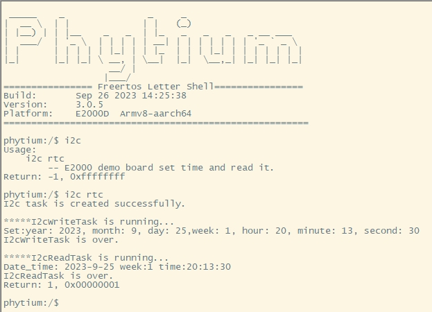
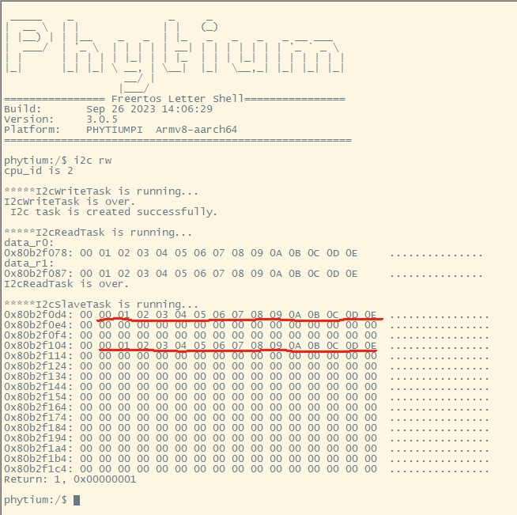

# i2c base on freertos

## 1. 例程介绍

本例程示范了freertos环境下的i2c的读写使用，包括i2c的初始化、写、读和去初始化操作；
(支持E2000DQ demo开发板)实现了读取RTC的例程。
(支持firefly开发板)本例程实现了I2C主从（Master-Slave）通信，主机侧是开发板的MIO1，负责发起I2C数据读写,此例程中我们master端仅采用poll模式去读写操作，从机侧是开发板的MIO2模拟eeprom，负责响应I2C数据读写，采用中断响应方式，从机侧实现了一个虚拟的EEPROM缓冲区，模拟主机侧写入和读取数据的过程。

## 2. 如何使用例程

本例程需要用到

- Phytium开发板（E2000DQ/phytiumpi）
- [Phytium freeRTOS SDK](https://gitee.com/phytium_embedded/phytium-free-rtos-sdk)
- [Phytium standalone SDK](https://gitee.com/phytium_embedded/phytium-standalone-sdk)

### 2.1 硬件配置方法

本例程支持的硬件平台包括

- E2000DQ demo、phytiumpi开发板

对应的配置项是

- CONFIG_TARGET_E2000D、 CONFIG_TARGET_E2000Q
- CONFIG_TARGET_PHYTIUMPI

### 2.1.1 硬件连线

- E2000



- phytiumpi



### 2.2 SDK配置方法

本例程需要，

- 使能Shell
- 使能I2C
- 如果是E2000系列，使能MIO

对应的配置项是，

- CONFIG_USE_LETTER_SHELL
- CONFIG_FREERTOS_USE_I2C
  如果是E2000系列
- CONFIG_FREERTOS_USE_MIO

本例子已经提供好具体的编译指令，以下进行介绍:
    1. make 将目录下的工程进行编译
    2. make clean  将目录下的工程进行清理
    3. make image   将目录下的工程进行编译，并将生成的elf 复制到目标地址
    4. make list_kconfig 当前工程支持哪些配置文件
    5. make load_kconfig LOAD_CONFIG_NAME=`<kconfig configuration files>`  将预设配置加载至工程中
    6. make menuconfig   配置目录下的参数变量
    7. make backup_kconfig 将目录下的sdkconfig 备份到./configs下

具体使用方法为:

- 在当前目录下
- 执行以上指令

### 2.3 构建和下载

#### 2.3.1 构建过程

- 在host侧完成配置

> 配置成平台，使用对应的默认配置，如E2000D `make load_kconfig LOAD_CONFIG_NAME=e2000d_aarch64_demo_i2c`

- 选择目标平台

E2000D demo板

```
make load_kconfig LOAD_CONFIG_NAME=e2000d_aarch64_demo_i2c
```

或者
phytiumpi 的 firefly板

```
make load_kconfig LOAD_CONFIG_NAME=phytiumpi_aarch64_firefly_i2c
```

- 选择例程需要的配置

```
make menuconfig
```

- 进行编译

```
make image 
```

- 将编译出的镜像放置到tftp目录下

```
make image
```

#### 2.3.2 下载过程

- host侧设置重启host侧tftp服务器

```
sudo service tftpd-hpa restart
```

- 开发板侧使用bootelf命令跳转

```
setenv ipaddr 192.168.4.20  
setenv serverip 192.168.4.50 
setenv gatewayip 192.168.4.1 
tftpboot 0x90100000 freertos.elf
bootelf -p 0x90100000
```

### 2.4 输出与实验现象

- 系统进入后，创建i2c初始化任务，创建i2c从机中断初始化，注册中断服务函数，创建i2c主机的读写任务函数。
- E2000支持i2c 读写RTC

```
i2c rtc
```



- phytiumpi 支持主从机进行通信，从设备控制器模拟eeprom

```
i2c rw
```



## 3. 如何解决问题

关于飞腾派上RTC问题，因未焊接DS1339芯片，所以未对飞腾派做例程操作支持。如果需要，可以参考现有的RTC例程，添加飞腾派配置即可。

## 4. 修改历史记录
