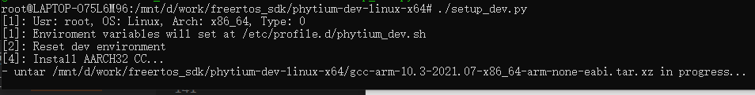
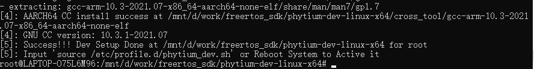
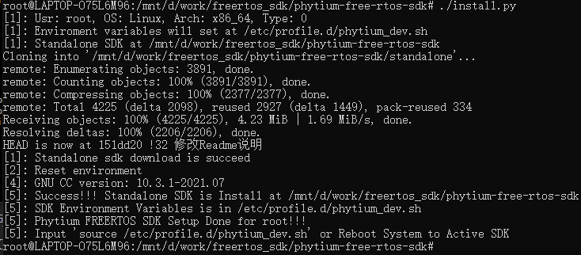
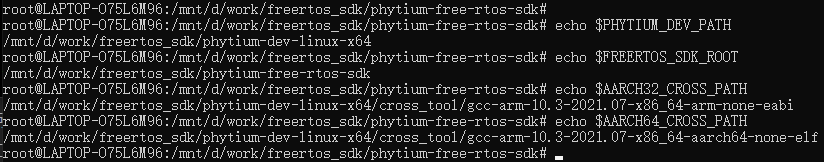

# 1. Linux x86_64 SDK安装方法

Linux x86_64下通过下载SDK开发工具包完成安装，运行脚本`source ./setup_dev.sh`完成安装，安装前请先确认当前设备属于`Linux x86_64`


Linux x86_64安装包集成了，
- `gcc-arm-10.3-2021.07-x86_64-aarch64-none-elf.tar.xz`和`gcc-arm-10.3-2021.07-x86_64-arm-none-eabi.tar.xz`,aarch64交叉编译链，SDK安装过程中会被解压到DEV目录的`cross_tool`目录下
- `setup_dev.py`, 安装脚本，主要的功能包括创建sdk的profile文件，创建`PHYTIUM_DEV_PATH`环境变量，通过git拉取SDK源码，以及完成SDK安装

## 1.1 获取SDK的开发环境

- [Linux x86_64](https://pan.baidu.com/s/1KsGcHoqOJ8nv4G1G-L5gtQ)

>提取码：LX64

- Linux环境下可以用unzip命令解压
- Linux环境下需要通过`sudo apt-get install build-essential`安装git, make和python3等工具

## 1.2 安装SDK开发环境

- (1). 解压开发环境压缩包，形成DEV目录


- (2). 进入DEV目录，运行`./setup_dev.py`，安装开发环境




-（3). 通过git拉取Phytium FreeRTOS SDK的代码，如

```
git clone https://gitee.com/phytium_embedded/phytium-free-rtos-sdk.git ./phytium-free-rtos-sdk
```

- (4). 进入Phytium FreeRTOS SDK代码目录，运行`./install.py`

```
cd ./phytium-free-rtos-sdk
./install.py
```


- (3). 安装完成后重启系统

### Q: 如果当前环境无法连接互联网

- 在执行第（2）步前，需要手动下载Phytium FreeRTOS SDK，放置在DEV目录下
- https://gitee.com/phytium_embedded/phytium-free-rtos-sdk
- 需要手动下载Phytium Standalone SDK，放置在DEV的standalone目录下
- https://gitee.com/phytium_embedded/phytium-standalone-sdk

## 1.3 检查安装是否成功

- 打印下列环境变量，观察各变量是否存在，指向的目录是否正确
> `PHYTIUM_DEV_PATH`指向DEV目录

> `FREERTOS_SDK_ROOT`指向SDK源文件目录

> `AARCH32_CROSS_PATH`指向32位交叉编译链目录

> `AARCH64_CROSS_PATH`指向64位交叉编译链目录

```
echo $PHYTIUM_DEV_PATH $FREERTOS_SDK_ROOT $AARCH32_CROSS_PATH $AARCH64_CROSS_PATH 
```


- 环境变量打印正确无误，表示**安装成功**
## 1.4 卸载开发环境

- 在DEV目录运行`./uninstall.py`完成SDK卸载

- 运行`rm /etc/profile.d/phytium_dev.sh`，删除SDK配置文件

- 重启系统完成卸载
