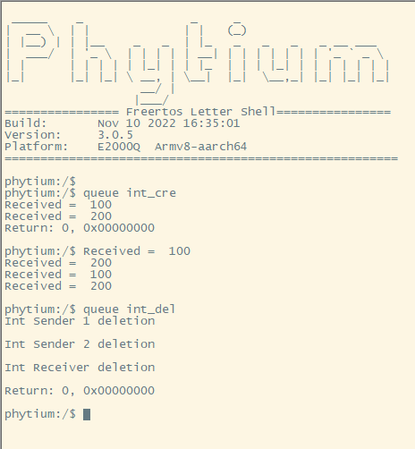
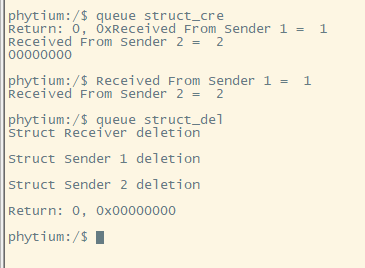
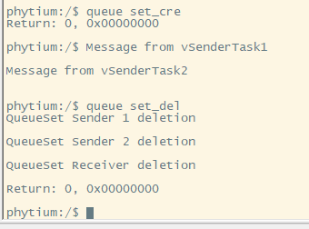

# queue feature base on freertos

## 1. 例程介绍

本例程示范了freertos环境下的queue的使用。
队列又称消息队列，是一种常用于任务间通信的数据结构，队列可以在任务与任务间、中断和任务间传递信息，实现了任务接收来自其他任务或中断的不固定长度的消息，任务能够从队列里面读取消息，当队列中的消息是空时，读取消息的任务将被阻塞，用户还可以指定阻塞的任务时间 xTicksToWait，在这段时间中，如果队列为空，该任务将保持阻塞状态以等待队列数据有效。当队列中有新消息时，被阻塞的任务会被唤醒并处理新消息；当等待的时间超过了指定的阻塞时间，即使队列中尚无有效数据，任务也会自动从阻塞态转为就绪态。消息队列是一种异步的通信方式。

## 2. 如何使用例程

本例程需要用到
- Phytium开发板（FT2000-4/D2000/E2000D/E2000Q/PHYTIUMPI）
- [Phytium freeRTOS SDK](https://gitee.com/phytium_embedded/phytium-free-rtos-sdk)
- [Phytium standalone SDK](https://gitee.com/phytium_embedded/phytium-standalone-sdk)
### 2.1 硬件配置方法

本例程支持的硬件平台包括

- FT2000-4
- D2000
- E2000D
- E2000Q
- PHYTIUMPI

对应的配置项是，

- CONFIG_TARGET_FT2004
- CONFIG_TARGET_D2000
- CONFIG_TARGET_E2000D
- CONFIG_TARGET_E2000Q
- CONFIG_TARGET_PHYTIUMPI

### 2.2 SDK配置方法

本例程需要，

- 使能Shell

对应的配置项是，

- CONFIG_USE_LETTER_SHELL

本例子已经提供好具体的编译指令，以下进行介绍:
- make 将目录下的工程进行编译
- make clean  将目录下的工程进行清理
- make image   将目录下的工程进行编译，并将生成的elf 复制到目标地址
- make list_kconfig 当前工程支持哪些配置文件
- make load_kconfig LOAD_CONFIG_NAME=<kconfig configuration files>  将预设配置加载至工程中
- make menuconfig   配置目录下的参数变量
- make backup_kconfig 将目录下的sdkconfig 备份到./configs下

具体使用方法为:
- 在当前目录下
- 执行以上指令

### 2.3 构建和下载

><font size="1">描述构建、烧录下载镜像的过程，列出相关的命令</font><br />

[参考 freertos 使用说明](../../../docs/reference/usr/usage.md)

#### 2.3.1 下载过程

- host侧设置重启host侧tftp服务器
```
sudo service tftpd-hpa restart
```

- 开发板侧使用bootelf命令跳转
```
setenv ipaddr 192.168.4.20  
setenv serverip 192.168.4.50 
setenv gatewayip 192.168.4.1 
tftpboot 0x90100000 freertos.elf
bootelf -p 0x90100000
```

### 2.4 输出与实验现象

- 系统进入后，输入```queue```查看指令说明
- 输入```queue int_cre```，启动queue的int类型数据的收发任务测试
- 输入```queue int_del```，删除queue的int类型数据的收发任务测试



- 输入```queue struct_cre```，启动queue的struct类型数据的收发任务测试
- 输入```queue struct_del```，删除queue的struct类型数据的收发任务测试



- 输入```queue set_cre```，启动queue的set函数使用，收发任务测试
- 输入```queue set_del```，删除queue的set函数使用，收发任务测试



- 测试任务能够能正常创建和删除，输入```ps```查看任务状态正常，即测试正常

## 3. 如何解决问题


## 4. 修改历史记录


