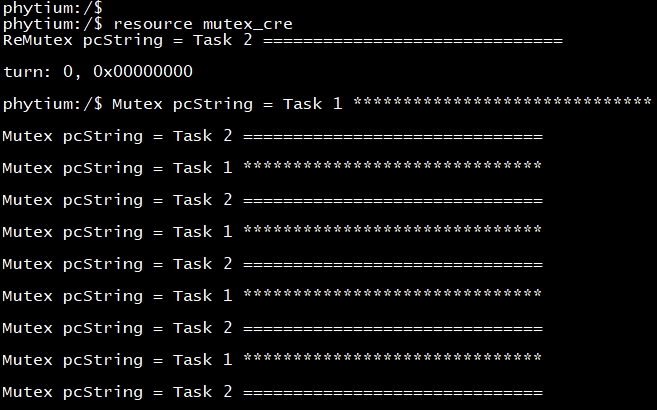
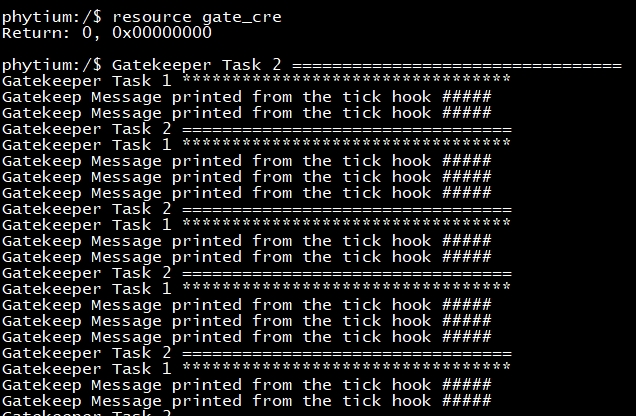

# resource base on freertos

## 1. 例程介绍

本例程示范了freertos环境下的互斥信号量与守护任务的特性。
互斥量是一种特殊的二值信号量，用于控制在两个或多个任务间访问共享资源。在用于互斥的场合，互斥量从概念上可看作是与共享资源关联的令牌。一个任务想要合法地访问资源，其必须先成功地得到(Take)该资源对应的令牌(成为令牌持有者)。当令牌持有者完成资源使用，其必须马上归还(Give)令牌。只有归还了令牌，其它任务才可能成功持有，也才可能安全地访问该共享资源。一个任务除非持有了令牌，否则不允许访问共享资源。
守护任务是对某个资源具有唯一所有权的任务。只有守护任务才可以直接访问其守护的资源——其它任务要访问该资源只能间接地通过守护任务提供的服务

## 2. 如何使用例程

本例程需要用到
- Phytium开发板（FT2000-4/D2000/E2000D/E2000Q/PHYTIUMPI）
- [Phytium freeRTOS SDK](https://gitee.com/phytium_embedded/phytium-free-rtos-sdk)
- [Phytium standalone SDK](https://gitee.com/phytium_embedded/phytium-standalone-sdk)
### 2.1 硬件配置方法

本例程支持的硬件平台包括

- FT2000-4
- D2000
- E2000D
- E2000Q
- PHYTIUMPI

对应的配置项是，

- CONFIG_TARGET_FT2004
- CONFIG_TARGET_D2000
- CONFIG_TARGET_E2000D
- CONFIG_TARGET_E2000Q
- CONFIG_TARGET_PHYTIUMPI

### 2.2 SDK配置方法

本例程需要，

- 使能Shell

对应的配置项是，

- CONFIG_USE_LETTER_SHELL

本例子已经提供好具体的编译指令，以下进行介绍:
- make 将目录下的工程进行编译
- make clean  将目录下的工程进行清理
- make image   将目录下的工程进行编译，并将生成的elf 复制到目标地址
- make list_kconfig 当前工程支持哪些配置文件
- make load_kconfig LOAD_CONFIG_NAME=<kconfig configuration files>  将预设配置加载至工程中
- make menuconfig   配置目录下的参数变量
- make backup_kconfig 将目录下的sdkconfig 备份到./configs下

具体使用方法为:
- 在当前目录下
- 执行以上指令

### 2.3 构建和下载

><font size="1">描述构建、烧录下载镜像的过程，列出相关的命令</font><br />

[参考 freertos 使用说明](../../../docs/reference/usr/usage.md)

#### 2.3.1 下载过程

- host侧设置重启host侧tftp服务器
```
sudo service tftpd-hpa restart
```

- 开发板侧使用bootelf命令跳转
```
setenv ipaddr 192.168.4.20  
setenv serverip 192.168.4.50 
setenv gatewayip 192.168.4.1 
tftpboot 0x90100000 freertos.elf
bootelf -p 0x90100000
```

### 2.4 输出与实验现象

- 系统进入后，输入```resource```查看指令说明
- 输入```resource mutex_cre```，启动互斥信号量任务测试
- 输入```resource mutex_del```，删除互斥信号量任务测试



- 输入```resource gate_cre```，启动守护任务测试
- 输入```resource gate_del```，删除守护任务测试



- 测试任务能够能正常创建和删除，输入```ps```查看任务状态正常，即测试正常

## 3. 如何解决问题


## 4. 修改历史记录


