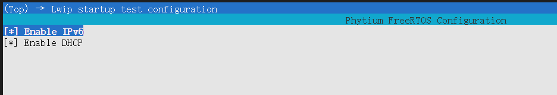
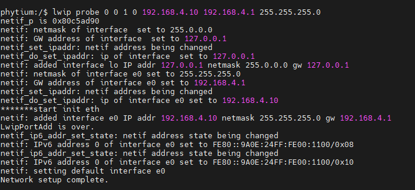
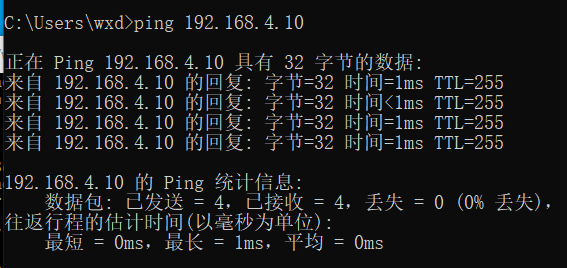
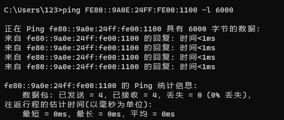
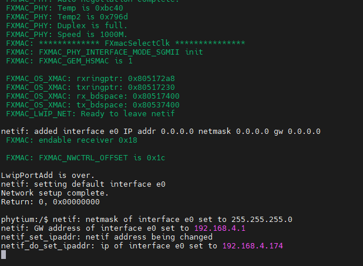
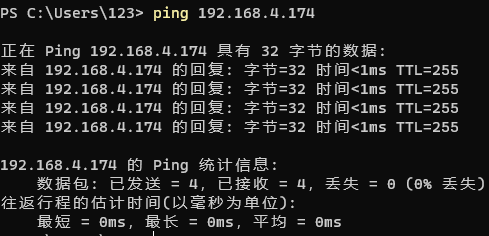

# lwip base on freertos

## 1. 例程介绍

- 本例程示范了freertos环境下的lwip移植。
- 并且介绍了开发者如何在我方sdk下如何正常初始化网络控制器

## 2. 如何使用例程

本例程需要用到
- Phytium开发板（E2000/D2000/FT2004）
- [Phytium freeRTOS SDK](https://gitee.com/phytium_embedded/phytium-free-rtos-sdk)
- [Phytium standalone SDK](https://gitee.com/phytium_embedded/phytium-standalone-sdk)
### 2.1 硬件配置方法

本例程支持的硬件平台包括

- E2000D/Q
- FT2004
- D2000
- PhytiumPi

对应的配置项是，

- CONFIG_TARGET_E2000D
- CONFIG_TARGET_E2000Q
- CONFIG_TARGET_FT2004
- CONFIG_TARGET_D2000
- CONFIG_TARGET_PHYTIUMPI

### 2.2 SDK配置方法

本例程需要，

- 使能LWIP

对应的配置项是，

- CONFIG_USE_LWIP
- CONFIG_USE_LETTER_SHELL

本例子已经提供好具体的编译指令，以下进行介绍:
- make 将目录下的工程进行编译
- make clean  将目录下的工程进行清理
- make image   将目录下的工程进行编译，并将生成的elf 复制到目标地址
- make list_kconfig 当前工程支持哪些配置文件
- make load_kconfig LOAD_CONFIG_NAME=< kconfig-nfiguration files > 将预设配置加载至工程中
- make menuconfig   配置目录下的参数变量
- make backup_kconfig 将目录下的sdkconfig 备份到./configs下

具体使用方法为:
- 在当前目录下
- 执行以上指令

### 2.3 构建和下载

#### 2.3.1 构建过程

本文档将以E2000Ddemo开发板为例，对于其它平台，使用对应的默认配置

- 在host端完成配置
- 选择目标平台

```
make load_kconfig LOAD_CONFIG_NAME=e2000d_aarch64_demo_lwip_startup
```

- 选择例程需要的配置

```
make menuconfig
```

- 进行编译

```
make
```

- 将编译出的镜像放置到tftp目录下

```
make image
```

#### 2.3.2 下载过程

- host侧设置重启host侧tftp服务器
```
sudo service tftpd-hpa start
```

- 开发板侧使用bootelf命令跳转
```
setenv ipaddr 192.168.4.20
setenv serverip 192.168.4.50 
setenv gatewayip 192.168.4.1 
tftpboot 0x90100000 freertos.elf
bootelf -p 0x90100000
```

### 2.4 输出与实验现象

- 启动进入后，根据连接的xmac口，输入指令完成网口初始化

### 2.4.1 如何配置demo 程序

- 本程序默认支持ipv4，开发者使用"make menuconfig"在以下配置选项中打开



- 如上图所示，开发者可以通过勾选 Enable IPv6 开启IPv6 的功能，通过勾选Enable DHCP 开启 dhcp client 功能


### 2.4.2 如何进行实验

- 当开发者配置好程序之后,通过2.3.1/2.3.2的方式将编译好的镜像文件拷贝至开发板中。
- 以E2000D/Q demo 板为例,开发者输入以下命令则可以初始化网卡：

```
lwip probe 0 0 1 0 192.168.4.10 192.168.4.1 255.255.255.0
```

命令定义为:
```
lwip probe <driver id> <device id> <interface id> <dhcp_en> <ipaddr> <gateway> <netmask> 
```
- driver id 为驱动类型 ， 0为xmac ，1为gmac
- device id 为mac控制器
- interface id 为gmii 控制器类型，0 is rgmii ,1 is sgmii
- dhcp_en 1为使能dhcp 功能，0为关闭dhcp 功能
- ipaddr 为ipv4 地址，示例为: 192.168.4.10
- gateway 为网关 ，示例为: 192.168.4.
- netmask 为子网掩码，示例为255.255.255.0


- 效果图如下





- 使能dhcp模式后，输入以下指令,开启dhcp网卡测试
```
lwip probe 0 0 1 1
```




## 3. 如何解决问题

## 4. 修改历史记录

v0.2.0  重构lwip

