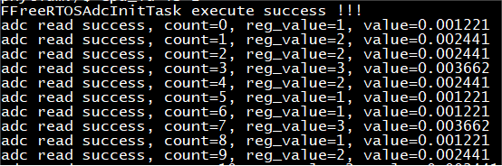
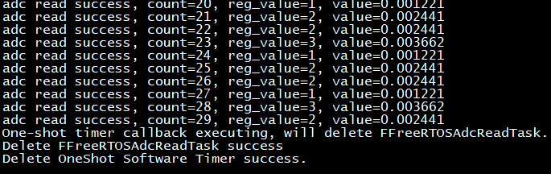

# adc base on freertos

## 1. 例程介绍

本例程示范了freertos环境下的adc的使用，包括adc的初始化、adc周期读取操作；
程序启动后，创建adc初始化任务，设置adc时钟分频、转换模式等；
创建adc定时读取任务FFreeRTOSAdcReadTask，用于定时读取adc转换结果；
创建单次模式的软件定时器，回调函数为删除FFreeRTOSAdcReadTask，去初始化adc，删除软件定时器；
使用C板进行测试，选择ADC0作为采样点，也就是adc0控制器的通道0，对应板上J154的引脚5；

目前E2000_demo开发板引出了的IO不支持，所以此例程的代码仅供参考！！！

## 2. 如何使用例程

本例程需要用到

- Phytium开发板（E2000D）
- [Phytium freeRTOS SDK](https://gitee.com/phytium_embedded/phytium-free-rtos-sdk)
- [Phytium standalone SDK](https://gitee.com/phytium_embedded/phytium-standalone-sdk)

### 2.1 硬件配置方法

本例程支持的硬件平台包括

- E2000D

对应的配置项是，

- CONFIG_TARGET_E2000D

### 2.2 SDK配置方法

本例程需要，

- 使能Shell
- 使能Adc

对应的配置项是，

- CONFIG_USE_LETTER_SHELL
- CONFIG_USE_ADC
- CONFIG_FREERTOS_USE_ADC

本例子已经提供好具体的编译指令，以下进行介绍:
- make 将目录下的工程进行编译
- make clean  将目录下的工程进行清理
- make image   将目录下的工程进行编译，并将生成的elf 复制到目标地址
- make list_kconfig 当前工程支持哪些配置文件
- make load_kconfig LOAD_CONFIG_NAME=<kconfig configuration files>  将预设配置加载至工程中
- make menuconfig   配置目录下的参数变量
- make backup_kconfig 将目录下的sdkconfig 备份到./configs下

具体使用方法为:
- 在当前目录下
- 执行以上指令

### 2.3 构建和下载

#### 2.3.1 构建过程

- 在host侧完成配置
  配置成e2000d
- 选择目标平台

```
make load_e2000d_aarch32
```

- 选择例程需要的配置

```
make menuconfig
```

- 编译清除

```
make clean
```

- 将编译出的镜像放置到tftp目录下

```
make image
```

#### 2.3.2 下载过程

- host侧设置重启host侧tftp服务器

```
sudo service tftpd-hpa restart
```

- 开发板侧使用bootelf命令跳转

```
setenv ipaddr 192.168.4.20  
setenv serverip 192.168.4.50 
setenv gatewayip 192.168.4.1 
tftpboot 0x90100000 freertos.elf
bootelf -p 0x90100000
```

### 2.4 输出与实验现象

- 系统进入后，创建adc初始化任务，创建定时读取任务，并创建单次模式软件定时器



- 定时器时间到，触发单次模式软件定时器的回调函数，去初始化adc，删除占空比变化任务，删除软件定时器



## 3. 如何解决问题

## 4. 修改历史记录
