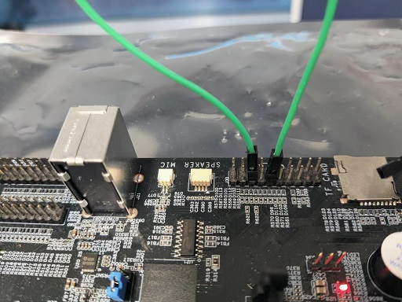
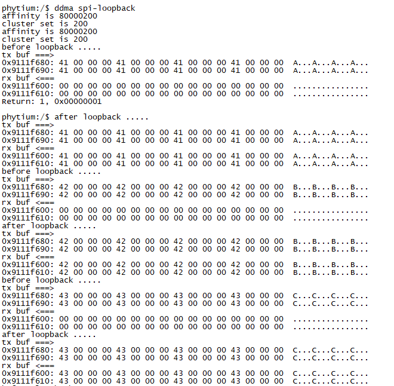

# DDMA-SPI回环测试

## 1. 例程介绍

DDMA (Device Direct Memory Access) 用于配合外设，将数据从一个内存地址复制到外设Fifo进行发送，CPU 只初始化和发起这个发送传输过程，传输动作本身是由 DDMA 控制器来实行和完成, 这样的操作让 CPU 不被数据搬运工作拖延，可以被重新调度去处理其它工作。

本例程通过 SPI 主设备驱动和 DDMA 控制器驱动，完成 SPI 回环数据搬运。 

## 2. 如何使用例程

本例程需要用到
- Phytium开发板（E2000）
- [Phytium FreeRTOS SDK](https://gitee.com/phytium_embedded/phytium-free-rtos-sdk)
- [Phytium Standalone SDK](https://gitee.com/phytium_embedded/phytium-standalone-sdk)

本例程在 E2000 Demo 板 与飞腾派上完成测试，默认的内部回环模式下，无需额外接线

如需要测试非内部回环模式，例如测试 E2000 D Demo 板的 SPI-2 ，测试前需要按照下图短接 SPI-2 的 RX 脚和 TX 脚，并合理修改代码
> RX 脚是 CPU_IO (J30) 的 5 脚和 9 脚


### 2.1 硬件配置方法

本例程支持的硬件平台包括

- E2000D
- E2000Q
- PHYTIUMPI

对应的配置项是，

- CONFIG_TARGET_E2000D
- CONFIG_TARGET_E2000Q
- CONFIG_TARGET_PHYTIUMPI

### 2.2 SDK配置方法

本例程需要，

- 使能Shell
- 使能SPI
- 使能DDMA

对应的配置项是，

- CONFIG_USE_LETTER_SHELL
- CONFIG_USE_FSPIM
- CONFIG_ENABLE_FDDMA

本例子已经提供好具体的编译指令，以下进行介绍:
- make 将目录下的工程进行编译
- make clean  将目录下的工程进行清理
- make image   将目录下的工程进行编译，并将生成的elf 复制到目标地址
- make list_kconfig 当前工程支持哪些配置文件
- make menuconfig   配置目录下的参数变量
- make backup_kconfig 将目录下的sdkconfig 备份到./configs下

具体使用方法为:
- 在当前目录下
- 执行以上指令

### 2.3 构建和下载

#### 2.3.1 构建过程

- 在host侧完成配置
> 配置成 e2000q，对于其它平台，使用对应的默认配置，如,

- 选择目标平台
```
make load_kconfig LOAD_CONFIG_NAME=e2000q_aarch64_demo_ddma
```

- 选择例程需要的配置
```
make menuconfig
```

- 编译并将编译出的镜像放置到tftp目录下
```
make image
```

#### 2.3.2 下载过程

- host侧设置重启host侧tftp服务器
```
sudo service tftpd-hpa restart
```

- 开发板侧使用bootelf命令跳转
```
setenv ipaddr 192.168.4.20  
setenv serverip 192.168.4.50 
setenv gatewayip 192.168.4.1 
tftpboot 0x90100000 freertos.elf
bootelf -p 0x90100000
```

### 2.4 输出与实验现象

- 系统进入后，创建任务初始化 SPI 和 DDMA，进行多次数据搬运

```
ddma spi-loopback
```




## 3. 如何解决问题

- Q: SPI 回环如何连接引脚
- A: 对于有 SPI 引脚接出的开发板, 使用外回环测试, 短接 SPI 的 TX 和 RX 引脚，在ddma_spi_loopback.c中将spim_config 的 inner_loopback 设置为 FALSE。对于没有 SPI 引脚的开发板，使用内回环测试，将 inner_loopback 设置为 TRUE，不需要连接 TX 和 RX 引脚


## 4. 修改历史记录


