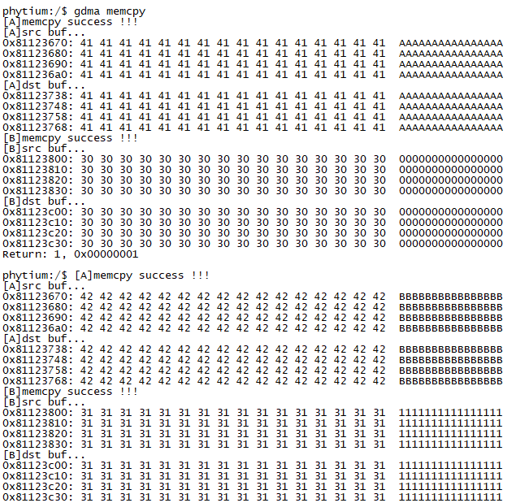

# GDMA内存搬运测试

## 1. 例程介绍

GDMA (Generic Direct Memory Access) 用于将数据从一个内存地址复制到另一个内存地址，CPU 只初始化和发起这个发送传输过程，传输动作本身是由 GDMA 控制器来实行和完成, 这样的操作让 CPU 不被数据搬运工作拖延，可以被重新调度去处理其它工作。

本例程通过 GDMA 控制器驱动，完成内存数据搬运。

## 2. 如何使用例程

本例程需要用到
- Phytium开发板（E2000）
- [Phytium FreeRTOS SDK](https://gitee.com/phytium_embedded/phytium-free-rtos-sdk)
- [Phytium Standalone SDK](https://gitee.com/phytium_embedded/phytium-standalone-sdk)

- 本例程在E2000D Demo 板测试通过，不需要进行额外连线

[](./figs/board.jpg)

### 2.1 硬件配置方法

本例程支持的硬件平台包括

- E2000D
- E2000Q
- PHYTIUMPI

对应的配置项是，

- CONFIG_TARGET_E2000D
- CONFIG_TARGET_E2000Q
- CONFIG_TARGET_PHYTIUMPI

### 2.2 SDK配置方法

本例程需要，

- 使能Shell
- 使能GDMA

对应的配置项是，

- CONFIG_USE_LETTER_SHELL
- CONFIG_FREERTOS_USE_FGDMA

本例子已经提供好具体的编译指令，以下进行介绍:
- make 将目录下的工程进行编译
- make clean  将目录下的工程进行清理
- make image   将目录下的工程进行编译，并将生成的elf 复制到目标地址
- make list_kconfig 当前工程支持哪些配置文件
- make menuconfig   配置目录下的参数变量
- make backup_kconfig 将目录下的sdkconfig 备份到./configs下

具体使用方法为:
- 在当前目录下
- 执行以上指令

### 2.3 构建和下载

#### 2.3.1 构建过程

- 在host侧完成配置
> 配置成 e2000q，对于其它平台，使用对应的的默认配置，如,

- 选择目标平台
```
make load_kconfig LOAD_CONFIG_NAME=e2000q_aarch64_demo_gdma
```

- 选择例程需要的配置
```
make menuconfig
```

- 编译并将编译出的镜像放置到tftp目录下
```
make image
```

#### 2.3.2 下载过程

- host侧设置重启host侧tftp服务器
```
sudo service tftpd-hpa restart
```

- 开发板侧使用bootelf命令跳转
```
setenv ipaddr 192.168.4.20  
setenv serverip 192.168.4.50 
setenv gatewayip 192.168.4.1 
tftpboot 0xa0100000 freertos.elf
bootelf -p 0xa0100000
```

### 2.4 输出与实验现象

- 系统进入后，创建任务 GDMA，将启动任务A和任务B，分别搬运数据

```
gdma memcpy
```




## 3. 如何解决问题


## 4. 修改历史记录


