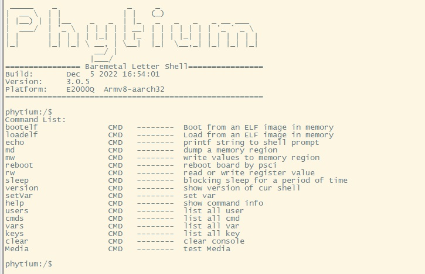
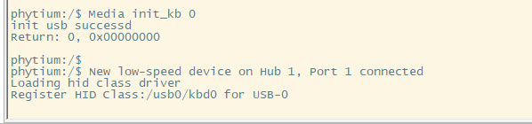
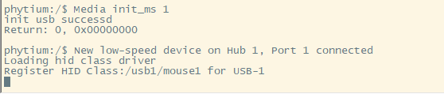
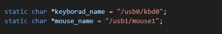
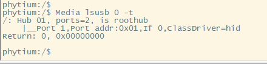
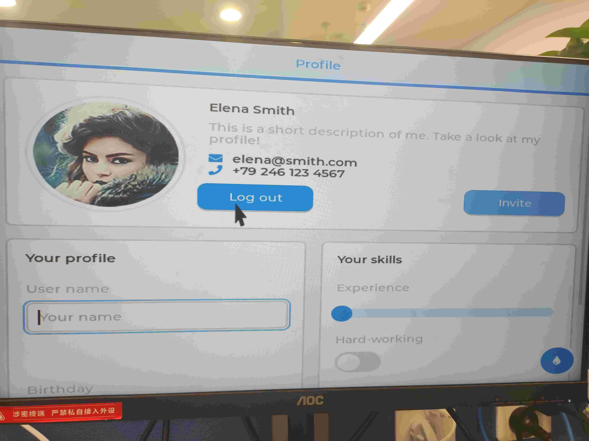

# media lvgl demo测试跑通benchmark

## 1. 例程介绍

>介绍例程的用途，使用场景，相关基本概念，描述用户可以使用例程完成哪些工作

DC 是一个显示控制器，主要完成将 CPU/GPU/VPU 处理后的图像数据，按照 Display 协议处理后送给 DP PHY 接入显示器。

本司E2000系列型号芯片采用DisplayPort1.4协议，兼容 DisplayPort1.4/Embedded DisplayPort1.3 协议。
本例程主要展示本司E2000系列芯片DC显示驱动功能以及驱动外设的能力，当前支持的设备有鼠标以及键盘

本例程支持的cmd包括

- md，读取一段内存的值
- mw，修改一段内存的值
- reboot, 重启baremetal运行环境
- test, 展示如何通过shell获取用户输入参数

## 2. 如何使用例程

><font size="1">描述开发平台准备，使用例程配置，构建和下载镜像的过程</font><br />

本例程需要用到

- Phytium开发板（E2000Q，E2000D）
- 显示器及连接线
- [Phytium Standalone SDK](https://gitee.com/phytium_embedded/phytium-standalone-sdk)

### 2.1 硬件配置方法

><font size="1">哪些硬件平台是支持的，需要哪些外设，例程与开发板哪些IO口相关等（建议附录开发板照片，展示哪些IO口被引出）</font><br />

本例程支持的硬件平台包括

- E2000Q AARCH32/AARCH64
- E2000D AARCH32/AARCH64
- Phytiumpi AARCH32/AARCH64

本例程所需的硬件设备包括

- 通过DP线将显示器与E2000板卡连接
- 利用串口调试线连接板卡和调试电脑，波特率设为 115200-8-1-N

### 2.2 SDK配置方法

><font size="1">依赖哪些驱动、库和第三方组件，如何完成配置（列出需要使能的关键配置项）</font><br />


- 本例子已经提供好具体的编译指令，以下进行介绍：
    - make 将目录下的工程进行编译
    - make clean  将目录下的工程进行清理
    - make image   将目录下的工程进行编译，并将生成的elf 复制到目标地址
    - make list_kconfig 当前工程支持哪些配置文件
    - make load_kconfig LOAD_CONFIG_NAME=<kconfig configuration files>  将预设配置加载至工程中
    - make menuconfig   配置目录下的参数变量
    - make backup_kconfig 将目录下的sdkconfig 备份到./configs下

- 具体使用方法为：
    - 在当前目录下
    - 执行以上指令

### 2.3 构建和下载

><font size="1">描述构建、烧录下载镜像的过程，列出相关的命令</font><br />

#### 2.3.1 构建过程

- 在host侧完成配置

>配置成E2000，对于其它平台，使用对应的默认配置
```
make load_kconfig LOAD_CONFIG_NAME=e2000q_aarch64_demo_media
make menuconfig
make image
```

- 在host侧完成构建

目前在menuconfig中支持配置色深,色深设置为32，其余设置值为third-party/lvgl-8.3/lv_conf.c设置默认值

在使用过程中， 使用者可根据实际硬件情况以及需要，在third-party/lvgl-8.3/lv_conf.c中进行相应组件配置。

#### 2.3.2 下载过程

- host侧设置重启host侧tftp服务器
```
sudo service tftpd-hpa restart
```
- 开发板侧使用bootelf命令跳转
```
setenv ipaddr 192.168.4.20  
setenv serverip 192.168.4.50 
setenv gatewayip 192.168.4.1 
tftpboot 0x90100000 freertos.elf
bootelf -p 0x90100000
```
### 2.4  输出与实验现象

><font size="1">描述输入输出情况，列出存在哪些输出，对应的输出是什么（建议附录相关现象图片）</font><br />

- 启动进入letter shell界面，按TAB键打印Command list




#### 2.4.1 初始化硬件设备控制器

初始化DP:

Media init 2 640 480 2 32 60

注：此色深32应与lvgl中的色深参数相等，否则可能出现画面填充错位的现象

- 2   :  通道号
- 640 ： 宽
- 480 ： 高
- 2   ：模式(克隆，水平，垂直)
- 32  ：色深
- 60  ：刷新率


初始化LVGL图形库：

Media lvgl-init

初始化键盘：

Media init-kb 0



初始化鼠标：

Media init-ms 1



注：在测试过程中，请将键盘接到usb 0 口，鼠标接到usb 1口，同时先init 键盘,再 init 鼠标，因为
usb 驱动中采用枚举方式查找设备。keyborad_name = "/usb0/kbd0"; mouse_name = "/usb1/mouse1";

当前phytiumpi板卡仅有一个usb3.0接口,因此同一时刻仅支持一个外设，可将鼠标或者键盘接入usb3.0。



查看设备：

Media lsusb 

根据串口打印输出，选择相应的命令，例如:

Media lsusb 0 -t

查看当前挂载设备信息



去初始化：

Media deinit 0

对相应dp口进行去初始化操作，可以设置为0：通道0；1：通道1；2：双通道

#### 2.4.2 example测试

Media demo

输入以上命令后,鼠标和键盘均能正常使用



## 3. 如何解决问题

><font size="1">主要记录使用例程中可能会遇到的问题，给出相应的解决方案</font><br />

若出现找不到设备的情况，串口会持续打印输出，无法找到设备，请检查接口顺序是否接正确，初始化是否成功，ls列出当前设备挂载信息
与程序中name 进行对比修改。


## 4. 修改历史记录

><font size="1">记录例程的重大修改记录，标明修改发生的版本号 </font><br />

- 2022-12-6 ：v0.0.1 添加example
- 2023-03-03: v0.0.2 添加多屏

