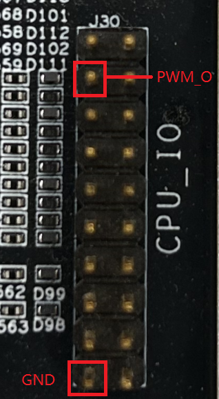
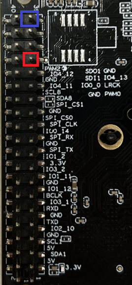
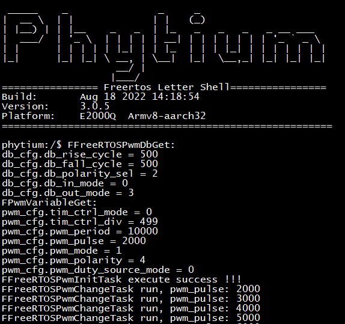
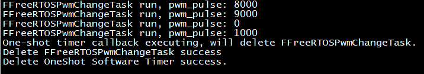
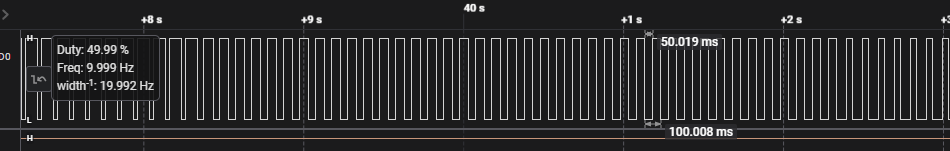

# pwm base on freertos

## 1. 例程介绍

本例程示范了freertos环境下的pwm的使用，包括pwm的初始化、pwm占空比周期变化操作；
程序启动后，创建pwm初始化任务，设置pwm时钟分频、周期和占空比等；
创建pwm占空比变化任务FFreeRTOSPwmChangeTask，用于定时变化pwm占空比；
创建单次模式的软件定时器，回调函数为删除FFreeRTOSPwmChangeTask，去初始化pwm，删除软件定时器；
使用E2000D/E2000Q demo板进行测试，选择pwm模块6的pwm12_dat_out作为输出，对应开发板上J30引脚7
使用C板进行测试，选择pwm模块7的两路pwm_out，也就是pwm14和pwm15作为输出，对应开发板上J152的引脚18和引脚20；
使用PhytiumPi进行测试，选择pwm模块2的pwm5_dat_out作为输出，对应开发板上J1引脚33

## 2. 如何使用例程

本例程需要用到
- Phytium开发板（E2000D/E2000Q/PhytiumPi）
- [Phytium freeRTOS SDK](https://gitee.com/phytium_embedded/phytium-free-rtos-sdk)
- [Phytium standalone SDK](https://gitee.com/phytium_embedded/phytium-standalone-sdk)
### 2.1 硬件配置方法

本例程支持的硬件平台包括

- E2000D
- E2000Q
- PhytiumPi

对应的配置项是，

- CONFIG_TARGET_E2000D
- CONFIG_TARGET_E2000Q
- CONFIG_TARGET_PHYTIUMPI

### 2.1.1 E2000
- E2000 demo板需外接逻辑分析仪或示波器测试，方法如下



- 上图所示为E2000 J30组引脚，将pwm_out与GND与逻辑分析仪或示波器相连即可

### 2.1.2 PhytiumPi
- PhytiumPi需外接逻辑分析仪或示波器测试，方法如下



-上图为PhytiumPi J1组引脚，第33号引脚为pwm(红色标记处)输出引脚，39号引脚(蓝色标记处)为GND，将该引脚与逻辑分析仪或示波器相连即可

### 2.2 SDK配置方法

本例程需要，

- 使能Shell
- 使能Pwm

对应的配置项是，

- CONFIG_USE_LETTER_SHELL
- CONFIG_USE_PWM
- CONFIG_FREERTOS_USE_PWM

本例子已经提供好具体的编译指令，以下进行介绍:
- make 将目录下的工程进行编译
- make clean  将目录下的工程进行清理
- make image   将目录下的工程进行编译，并将生成的elf 复制到目标地址
- make list_kconfig 当前工程支持哪些配置文件
- make load_kconfig LOAD_CONFIG_NAME=<kconfig configuration files>  将预设配置加载至工程中
- make menuconfig   配置目录下的参数变量
- make backup_kconfig 将目录下的sdkconfig 备份到./configs下

具体使用方法为:
- 在当前目录下
- 执行以上指令

### 2.3 构建和下载

><font size="1">描述构建、烧录下载镜像的过程，列出相关的命令</font><br />

[参考 freertos 使用说明](../../../docs/reference/usr/usage.md)

#### 2.3.1 下载过程

- host侧设置重启host侧tftp服务器
```
sudo service tftpd-hpa restart
```

- 开发板侧使用bootelf命令跳转
```
setenv ipaddr 192.168.4.20  
setenv serverip 192.168.4.50 
setenv gatewayip 192.168.4.1 
tftpboot 0x90100000 freertos.elf
bootelf -p 0x90100000
```

### 2.4 输出与实验现象

- 系统进入后，创建pwm初始化任务，创建占空比变化任务，并创建单次模式软件定时器



- 定时器时间到，触发单次模式软件定时器的回调函数，去初始化pwm，删除占空比变化任务，删除软件定时器



- 输出波形如下所示


## 3. 如何解决问题

- 若不想使能死区输出，可将FFreeRTOSPwmDbSet的部分去除，只需调用FFreeRTOSPwmSet即可。

## 4. 修改历史记录


