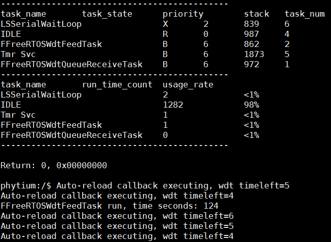
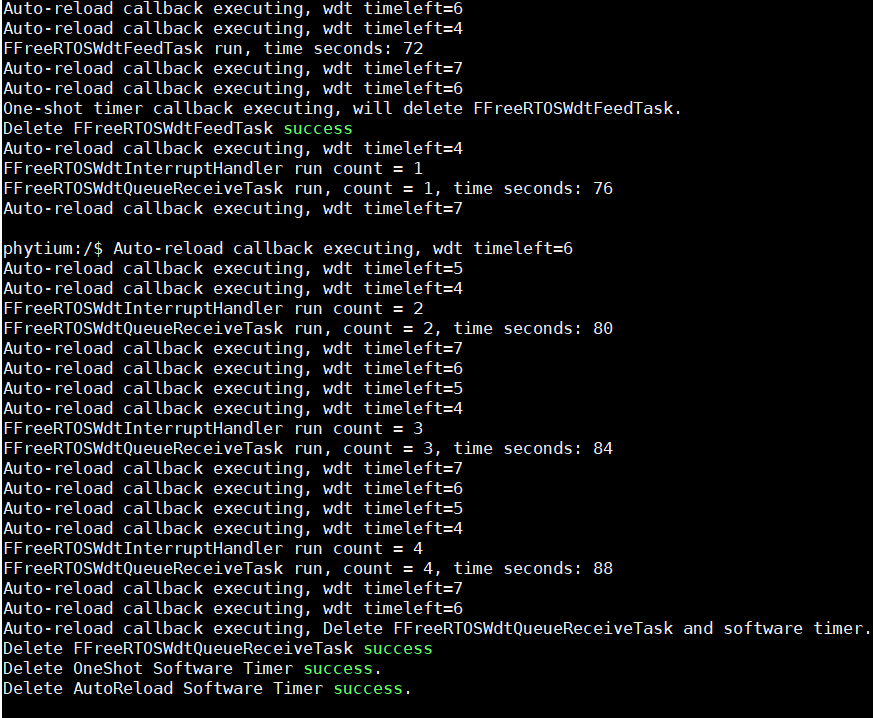

# wdt base on freertos

## 1. 例程介绍

本例程示范了freertos环境下的wdt的使用，包括看门狗的初始化、喂狗和去初始化操作；
程序启动后，创建消息队列用于超时中断消息传递，创建wdt初始化任务，指定超时中断处理函数；
创建消息队列接收任务FFreertosWdtQueueReceiveTask，用于接收超时中断处理函数发送的消息队列；
创建主动喂狗任务FFreertosWdtFeedTask，用于定时主动喂狗，这个周期比中断超时时间短；
创建单次模式的软件定时器，回调函数为删除FFreertosWdtFeedTask;
创建周期模式的软件定时器，定时获取wdt超时的倒计时，并在累计计数后，去初始化wdt，删除FFreertosWdtQueueReceiveTask和软件定时器；

## 2. 如何使用例程

本例程需要用到
- Phytium开发板（FT2000-4/D2000/E2000D/E2000Q/PhytiumPi）
- [Phytium freeRTOS SDK](https://gitee.com/phytium_embedded/phytium-free-rtos-sdk)
- [Phytium standalone SDK](https://gitee.com/phytium_embedded/phytium-standalone-sdk)
### 2.1 硬件配置方法

本例程支持的硬件平台包括

- FT2000-4
- D2000
- E2000D
- E2000Q
- PhytiumPi

对应的配置项是，

- CONFIG_TARGET_FT2004
- CONFIG_TARGET_D2000
- CONFIG_TARGET_E2000D
- CONFIG_TARGET_E2000Q
- CONFIG_TARGET_PHYTIUMPI

### 2.2 SDK配置方法

本例程需要，

- 使能Shell
- 使能Wdt

对应的配置项是，

- CONFIG_USE_LETTER_SHELL
- CONFIG_USE_WDT
- CONFIG_FREERTOS_USE_WDT

本例子已经提供好具体的编译指令，以下进行介绍:
- make 将目录下的工程进行编译
- make clean  将目录下的工程进行清理
- make image   将目录下的工程进行编译，并将生成的elf 复制到目标地址
- make list_kconfig 当前工程支持哪些配置文件
- make load_kconfig LOAD_CONFIG_NAME=<kconfig configuration files>  将预设配置加载至工程中
- make menuconfig   配置目录下的参数变量
- make backup_kconfig 将目录下的sdkconfig 备份到./configs下

具体使用方法为:
- 在当前目录下
- 执行以上指令

### 2.3 构建和下载

><font size="1">描述构建、烧录下载镜像的过程，列出相关的命令</font><br />

[参考 freertos 使用说明](../../../docs/reference/usr/usage.md)

#### 2.3.1 下载过程

- host侧设置重启host侧tftp服务器
```
sudo service tftpd-hpa restart
```

- 开发板侧使用bootelf命令跳转
```
setenv ipaddr 192.168.4.20  
setenv serverip 192.168.4.50 
setenv gatewayip 192.168.4.1 
tftpboot 0x90100000 freertos.elf
bootelf -p 0x90100000
```

### 2.4 输出与实验现象

- 系统进入后，创建wdt初始化任务，创建消息队列接收任务和主动喂狗任务，并创建单次模式和周期模式软件定时器，主动喂狗任务正常运行



- 定时器时间到，触发单次模式软件定时器的回调函数，删除主动喂狗任务；
这个时候由于没有了主动喂狗，超时中断会触发，中断处理函数中发送消息队列，消息队列接收任务正常接收后处理数据；
周期模式软件定时器累计计数到30s后，去初始化wdt，删除消息队列接收任务，删除软件定时器



## 3. 如何解决问题


## 4. 修改历史记录


