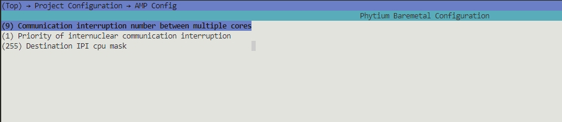
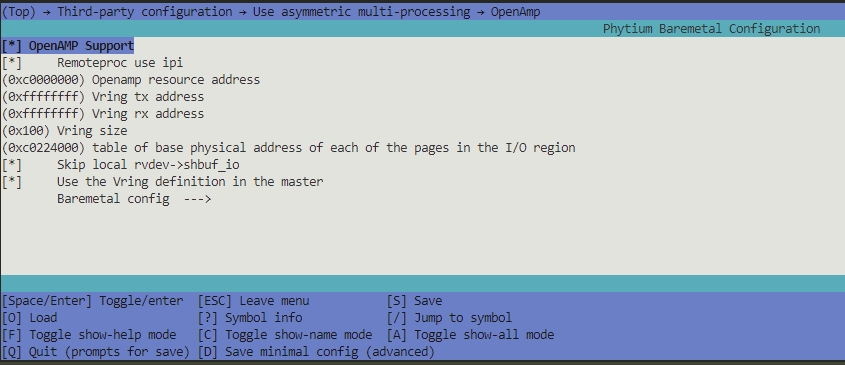
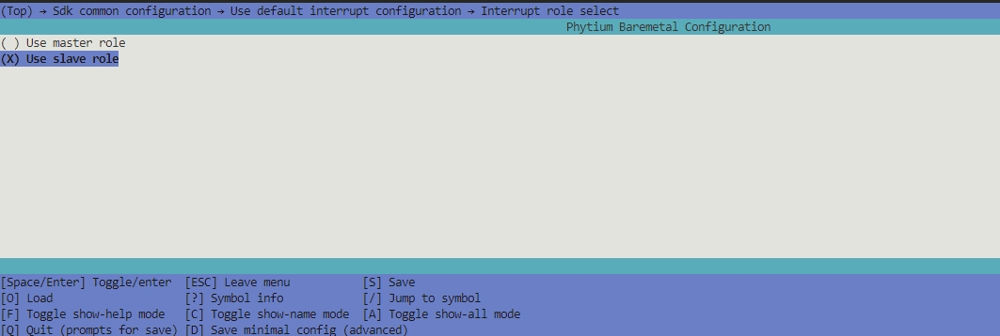
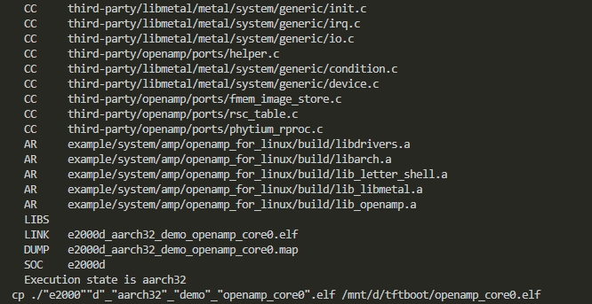
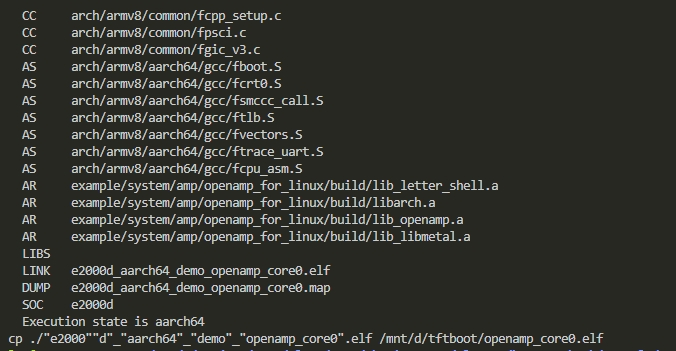

# OPENAMP 测试

## 1. 例程介绍

> 介绍例程的用途，使用场景，相关基本概念，描述用户可以使用例程完成哪些工作  

- OpenAMP(Open Asymmetric Multi-processing) 是一个软件架构，为多核之间非对称运行提供软件支持 。
- OpenAMP 提供了以下关键特性:

1. 提供生命周期管理
2. 兼容裸跑、RTOS等不同的软件环境
3. 兼容linux系统中的 remoteproc, rpmsg and VirtIO 模块

- 本例程基于开源openamp项目
  [OpenAMP](https://github.com/OpenAMP/open-amp.git)
- 本例程主要提供了D2000/FT2004/E2000D/E2000Q/PHYTIUMPI RTOS与RTOS之间的测试例程 ，RTOS 与 linux kernel 的测试例程
- 本例程演示rpmsg用法的示例演示应用程序。此应用core0 中的程序为从机程序，core1 中的程序为主机程序，其目标是从核程序工作在echo 模式下，主核主动发送数据之后，从机程序会将收到的数据重新回复回来

## 2. 如何使用例程

> 描述开发平台准备，使用例程配置，构建和下载镜像的过程  

### 2.1 硬件配置方法

> 哪些硬件平台是支持的，需要哪些外设，例程与开发板哪些IO口相关等（建议附录开发板照片，展示哪些IO口被引出） 

1. 准备一块 D2000 、FT2004 、 E2000Q/D 、firefly开发板中任意一款
2. 将串口连接好电脑，波特率设为 115200-8-1-N
3. 参阅《飞腾嵌入式OpenAMP技术解决方案与用户操作手册v1.0》配置好linux环境，本例程只提供编译镜像
4. 注意linux4.19内核只支持aarch32编译的镜像 *.elf 文件。

### 2.2 SDK配置方法

> 依赖哪些驱动、库和第三方组件，如何完成配置（列出需要使能的关键配置项） 

本例子已经提供好具体的编译指令，以下进行介绍:
- make 将目录下的工程进行编译
- make clean  将目录下的工程进行清理
- make image   将目录下的工程进行编译，并将生成的elf 复制到目标地址
- make list_kconfig 当前工程支持哪些配置文件
- make load_kconfig LOAD_CONFIG_NAME=<kconfig configuration files>  将预设配置加载至工程中
- make menuconfig   配置目录下的参数变量
- make backup_kconfig 将目录下的sdkconfig 备份到./configs下

具体使用方法为:
- 在当前目录下
- 执行以上指令

### 2.3 构建和下载

> 描述构建、烧录下载镜像的过程，列出相关的命令  

#### OpenAMP 配置

- 以E2000D为例,加载E2000D aarch32位，输入 `` make config_e2000d_aarch32 ` 

#### core0 构建配置

- Destination IPI mask               : ipi 中断中，用于唤醒其他核心的掩码
- Select mem default attribute       : 提供内存属性选择

- Remoteproc use ipi       : 使用ipi 中断模式进行提醒
- Openamp resource address : OpenAMP 中共享资源表中地址
- Vring tx address         : 共享发送缓冲区的起始地址，同时也是共享buffer 区域的起始地址
- Vring rx address         : 共享接收缓冲区的起始地址
- table of base physical address of each of the pages in the I/O region : 用于核心间提醒机制的共享内存初始点

### 2.4 输出与实验现象

> 描述输入输出情况，列出存在哪些输入，对应的输出是什么（建议附录相关现象图片） 

#### E2000 aarch32 裸机程序测试 （与linux）

以E2000为例

1. 进入amp/openamp_for_linux 目录
2. 输入 `` make config_e2000d_aarch32 `` 加载E2000D默认配置项目，其他配置项可以输入 ` make config_ ` 后按tab键查看支持哪些默认配置项目
3. 在 Sdk common configuration → Use default interrupt configuration → Interrupt role select  选项中选择 use slave role

   

4. 目录下输入 "make clean"  "make image" ,生成elf 文件之后，将其拷贝至linux 指定目录下

   

#### E2000 aarch64 裸机程序测试 （仅适用于linux 5.10）

以E2000为例

1. 进入amp/openamp_for_linux 目录
2. 输入 `` make config_e2000d_aarch64 `` 加载E2000D默认配置项目，其他配置项可以输入 ` make config_ ` 后按tab键查看支持哪些默认配置项目
3. 在 Sdk common configuration → Use default interrupt configuration → Interrupt role select  选项中选择 use slave role

   

4. 目录下输入 "make clean"  "make image" ,生成elf 文件之后，将其拷贝至linux 指定目录下

   

## 3. 如何解决问题 (Q&A)
> 主要记录使用例程中可能会遇到的问题，给出相应的解决方案

## 4. 修改历史记录
> 记录例程的重大修改记录，标明修改发生的版本号

- 2021-03-21 ：v0.1.0 初始化项目
- 2023-03-09 : v0.2.0 增加对e2000 的支持
- 2023-11-14 ：v0.3.0 重新适配