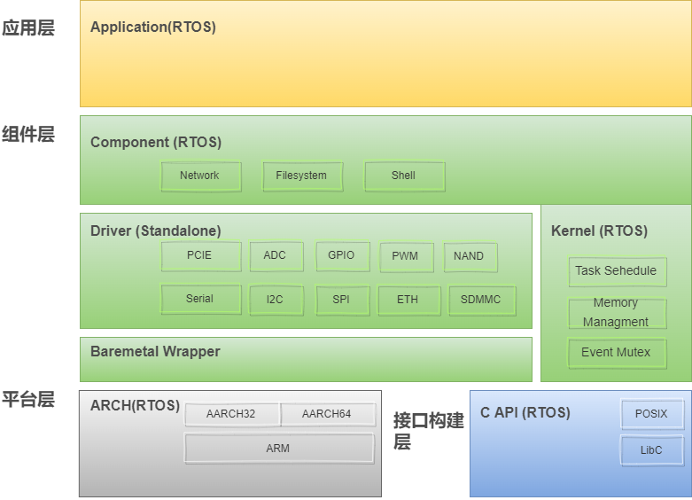
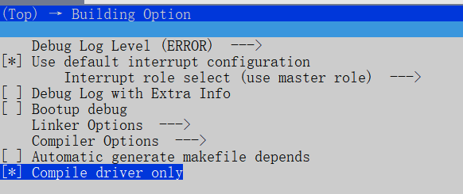
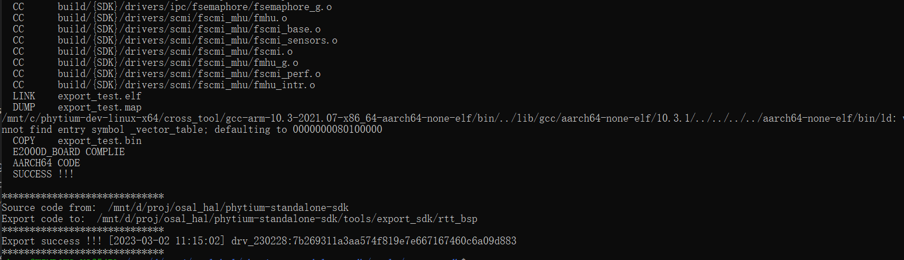
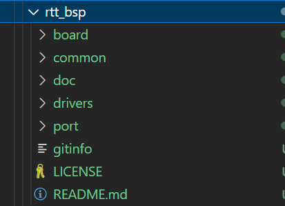
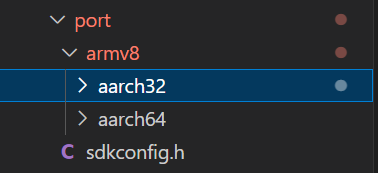
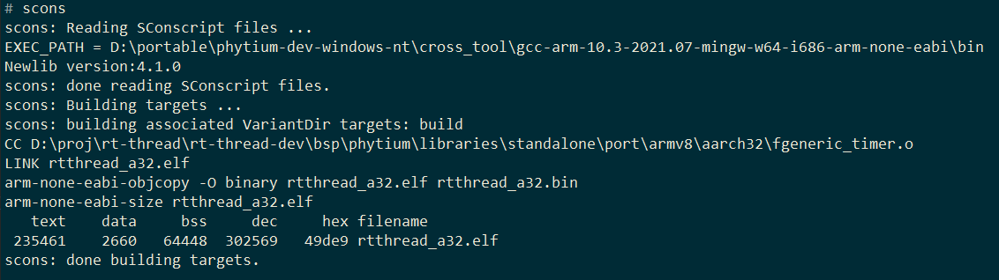
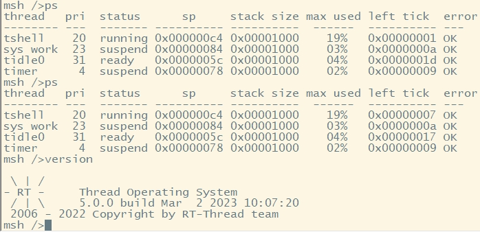

# 导出 Standalone Driver

## 背景介绍

- 在很多情况下，Standalone SDK 中的 Driver 组件需要移植到其它的 RTOS，而许多目标 RTOS （例如 rt-thread、lite-os 等） 往往会提供公用的板级支持，例如 ARM 体系结构的支持，C 标准库的实现等，上层的通用组件和应用程序也需要使用目标 RTOS 的接口
- 在这种情况下，在目标 RTOS 使用 Standalone SDK 就需要将 Baremetal 相关的体系结构支持（ARCH），板级别支持（BOARD 中的 MMU）, 以及第三方组件进行裁剪，生成一个只有 Driver 及其最小依赖的 BSP 包，然后移植到目标 RTOS 进行使用
- 后面介绍了如何导出 Standalone SDK 中的 Driver 组件，并结合 RT-Thread 中的移植进行了说明

## 思路和方法

- 在目标 RTOS 中使用 Standalone SDK Driver 的基本框图如下所示，主要需要完成的工作是导出 Standalone SDK Driver 的源码，实现 Driver Port 中的接口



## 制作 RT-Thread BSP

- 1. 在 Building Option 中打开配置 `Compile driver only`



- 这个开关的主要作用是将 ARCH 等组件排除出编译过程，测试裁剪后 Standalone SDK 能否编译成功，Driver 组件依赖的符号都能找到

- 2. 导出 RT-Thread 的 BSP

```
make export_rtt_sdk
```



- 导出前会先尝试编译一次，通过 port 目录下的 Wrapper 函数，寻找 Driver 中依赖的所有符号，可以看到，链接时找不到 _vector_table，这是正常，因为我们没有把 ARCH 部分编进来，缺少启动和异常向量（留给 RTOS 去实现），所以这次编译出的镜像肯定是启动不了的

- 可以看到，导出的 rtt_bsp 已经将不需要的代码剔除掉了



- 3. 将导出的 Standalone Driver 移植到 RT-Thread

- 通过 `make export_rtt_sdk` 导出的是 Standalone SDK 中的部分代码，因为许多 RTOS 会实现处理器架构相关的基础代码，在这些 RTOS 上使用 Standalone Driver 前，需要移除重复的代码
- 将 rtt_bsp 复制到 RT-Thread 源码目录 `bsp\phytium\libraries\standalone`, 然后修改 port 目录，首先实现 port 目录下的方法，这些方法是 Driver 中依赖的，导出后里面是一些桩函数，不能使用，需要用目标 RTOS 中的方法去实现 



```c
- 导出后
_WEAK void FCacheDCacheInvalidate(void)
{
    FASSERT_MSG(0, "%s not implment !!!", __func__);
}
```

```c
- 适配 rt-thread
void FCacheDCacheInvalidate(void)
{
    rt_hw_dcache_invalidate_all();
}
```

- 然后要将 sdkconfig.h 与 rtconfig.h 进行绑定，将 rtconfig.h 的配置翻译成 Standalone Driver 中使用的

```c
#include "rtconfig.h"

#ifdef __cplusplus
extern "C" {
#endif

#if defined(TARGET_ARMV8_AARCH32)
#define CONFIG_TARGET_ARMV8_AARCH32
#elif defined(TARGET_ARMV8_AARCH64)
#define CONFIG_TARGET_ARMV8_AARCH64
#endif
```

- 4. 后面就可以尝试编译和启动 RT-Thread


